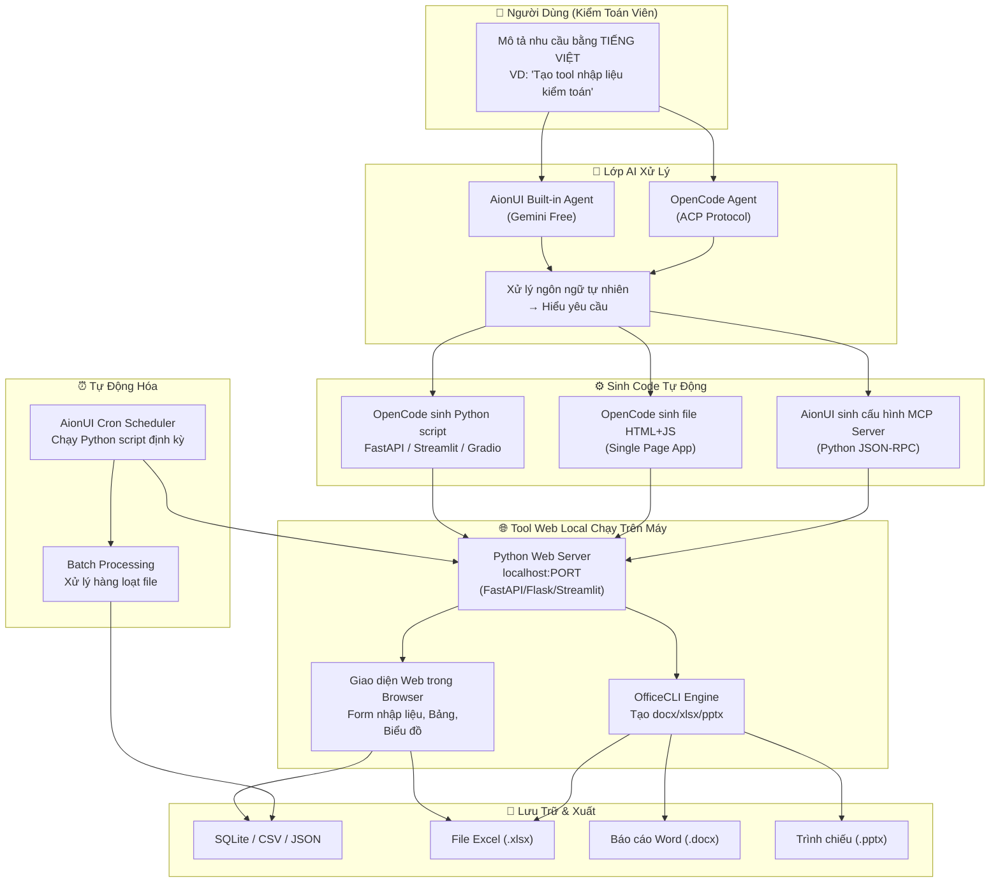
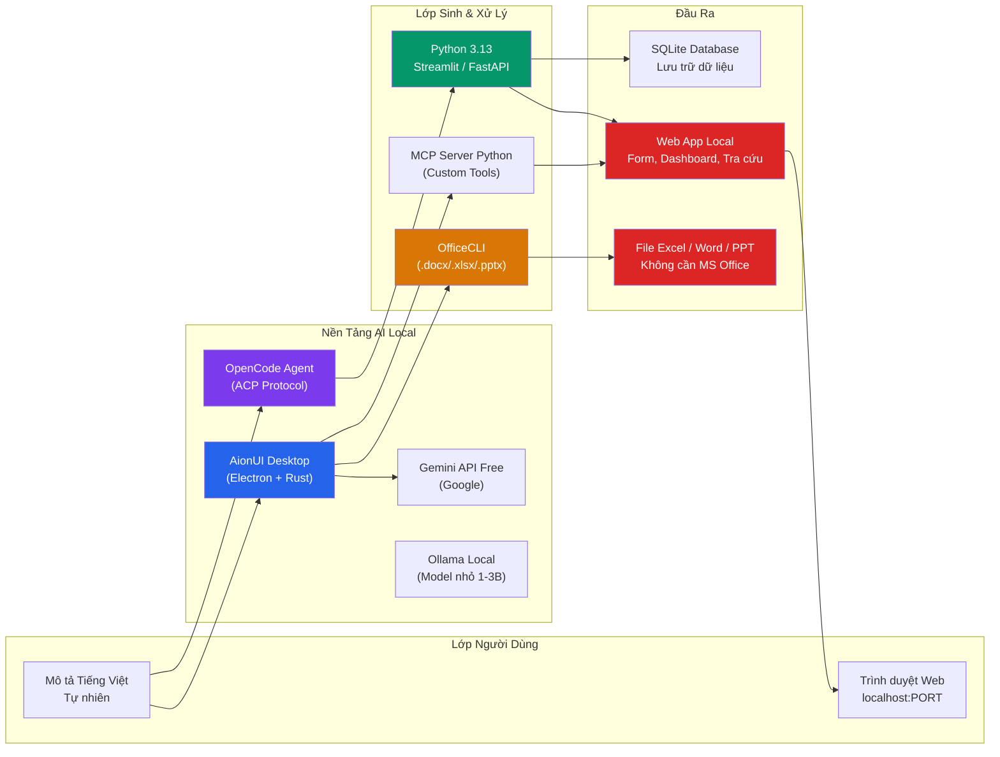
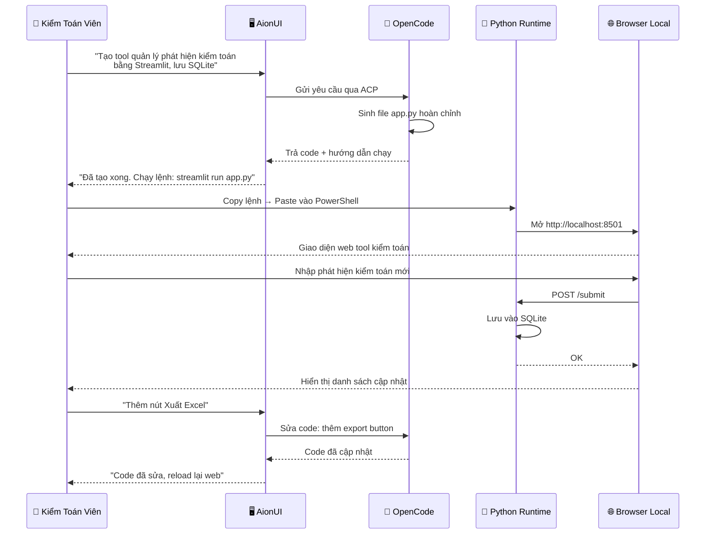

# I. Phân tích cơ chế phát triển thiết kế và xây dựng Ứng dụng tiện ích:

>>>Nêu kịch bản tổng quan về các cách phát triển thiết kế và xây dựng các tools chạy trên local pc mà hiệu quả kinh tế, 
không phạm luật bản quyền cho người dùng Chyyeen gia kiểm toán không chuyên cntt và 
không lập trình nhưng có aionui và opencode, python 3.13 và không có ms ofice trên máy labs chạy aionui + opencode. 
Vẽ sơ đồ cơ chế tạo tools chạy web local của aionui + opencode + py.
---
Để phát triển các công cụ (tools) kiểm toán chạy cục bộ (local PC) hiệu quả, 
an toàn pháp lý và không tốn chi phí bản quyền, chuyên gia kiểm toán có thể tận dụng tối đa sức mạnh của 
trí tuệ nhân tạo từ AIONUI / OpenCode để tự động tạo ra mã nguồn Python 3.13 mà không cần tự viết code. 
Do môi trường Lab không có MS Office, toàn bộ việc xử lý dữ liệu sẽ chuyển dịch sang các định dạng mở.

## Kịch bản tổng quan phát triển Tools Local cho Kiểm toán viên
Kịch bản này giúp bạn xây dựng công cụ kiểm toán hoàn toàn miễn phí, 
bảo mật dữ liệu tuyệt đối (do chạy offline) và tuân thủ luật bản quyền bằng cách sử dụng phần mềm mã nguồn mở.

## 1. Chiến lược thay thế MS Office (Xử lý File)

* Dữ liệu bảng tính: Thay thế Excel bằng thư viện pandas và openpyxl để đọc/ghi file .xlsx hoặc .csv.
* Báo cáo kiểm toán: Thay thế Word/PowerPoint bằng thư viện python-docx hoặc xuất thẳng ra định dạng PDF/HTML.
* Giao diện làm việc: Thay thế các bảng tính thủ công bằng giao diện Web Local trực quan.

## 2. Quy trình 4 bước phát triển bằng AI (Không code)

* Bước 1 (Định hình): Kiểm toán viên chuẩn bị file dữ liệu mẫu (đã xóa thông tin nhạy cảm) và viết yêu cầu bằng tiếng Việt rõ ràng.
* Bước 2 (Prompting): Gửi yêu cầu vào AIONUI / OpenCode, chỉ định rõ: "Viết code Python 3.13 tạo giao diện web bằng Streamlit/Gradio để xử lý file này...".
* Bước 3 (Thực thi): Copy đoạn code Python do AI tạo ra, lưu thành file .py trên máy Lab.
* Bước 4 (Vận hành): Chạy file bằng lệnh Python để mở giao diện kiểm toán trên trình duyệt web local (Chrome/Edge).

## 3. Các nhóm Tools kiểm toán ưu tiên phát triển

* Tool đối chiếu dữ liệu: Tự động so sánh hai sổ cái, phát hiện chênh lệch dòng tiền hoặc sai lệch mã định danh.
* Tool kiểm tra chứng từ: Quét và lọc tự động các hóa đơn trùng lặp, sai ngày tháng, hoặc vượt định mức phê duyệt.
* Tool phân tích rủi rủi ro: Phân tích quy luật Benford để phát hiện gian lận số liệu kế toán.
* Tool tổng hợp báo cáo: Gom hàng trăm file Excel chi nhánh thành một file tổng hợp duy nhất chỉ trong vài giây.

------------------------------
## Sơ đồ cơ chế tạo Tools Web Local (AIONUI + OpenCode + Python)
Dưới đây là sơ đồ dòng chảy chức năng (Luồng xử lý và Kiến trúc hệ thống) thể hiện cách AIONUI/OpenCode kết hợp với Python tạo ra một ứng dụng Web chạy ngay trên máy tính của bạn:

+-----------------------------------------------------------------------+
|                       GIAI ĐOẠN 1: TẠO MÃ NGUỒN                       |
|                                                                       |
|  [Kiểm toán viên] --(1. Nhập yêu cầu nghiệp vụ)--> [AIONUI/OpenCode]  |
|                                                            |          |
|  [File Python .py] <---(2. Tự động sinh code Python 3.13)--+          |
+-----------------------------------------------------------------------+
                                   |
                                   v (3. Kích hoạt chạy file trên PC)
+-----------------------------------------------------------------------+
|                  GIAI ĐOẠN 2: CƠ CHẾ VẬN HÀNH LOCAL                   |
|                                                                       |
|  +--------------------+   (Trình duyệt Web)   +--------------------+  |
|  |     TRÌNH DUYỆT    |                       |  MÔI TRƯỜNG PYTHON |  |
|  |     (WEB BROWSER)  |                       |     (LOCAL PC)     |  |
|  |                    |                       |                    |  |
|  | [Giao diện Tool]   | --(4. Upload dữ liệu)--> [Thư viện Web]    |  |
|  | (Nút bấm, Ô nhập)  |                       | (Streamlit/Gradio) |  |
|  |                    |                       |          |         |  |
|  |                    |                       | (5. Gọi hàm xử lý) |  |
|  |                    |                       |          v         |  |
|  | [Kết quả trực quan]| <-(7. Gửi kết quả Web)-- [Nhân xử lý dòng] |  |
|  | (Bảng biểu, Đồ thị)|                       | (Pandas / Numpy)   |  |
|  |                    |                       |          |         |  |
|  | [Nút Tải Báo Cáo]  | <---(8. Xuất File)----+  (Đọc/Ghi file)    |  |
|  +--------------------+                       |          v         |  |
|                                               | [File Báo Cáo]     |  |
|                                               | (.csv, .xlsx, .pdf)|  |
|                                               +--------------------+  |
+-----------------------------------------------------------------------+

## Giải thích chi tiết cơ chế hoạt động:

   1. Yêu cầu (Prompt): Bạn cung cấp tư duy logic kiểm toán cho AI. Ví dụ: "Tạo giao diện web có nút chọn file Excel, lọc ra các hàng có cột 'Thành tiền' rỗng và cho tải file kết quả về".
   2. Sinh mã: OpenCode đóng vai trò là kỹ sư lập trình, biên dịch logic nghiệp vụ của bạn thành mã nguồn Python 3.13 chuẩn, sử dụng các thư viện giao diện web nhẹ như Streamlit hoặc Gradio.
   3. Khởi chạy Local Server: Khi bạn thực thi file Python, một máy chủ web ảo (Localhost - thường là cổng http://localhost:8501) sẽ tự động được dựng lên ngay trong bộ nhớ RAM của máy tính bạn. 
   Nó hoàn toàn cô lập, không gửi dữ liệu ra Internet.
   4. Tương tác (Frontend - Trình duyệt): Bạn mở trình duyệt Web có sẵn trên máy (Chrome, Edge), truy cập địa chỉ Localhost để thấy giao diện tool làm việc trực quan.
   5. Xử lý (Backend - Python Engine): Khi bạn kéo thả file dữ liệu vào giao diện web, thư viện Pandas (thay thế cho Excel) sẽ đảm nhận việc tính toán, đối chiếu, lọc dữ liệu với tốc độ cao.
   6. Trả kết quả: Kết quả sau khi lọc được đẩy ngược lại màn hình trình duyệt dưới dạng bảng biểu tường minh hoặc xuất ra file báo cáo sạch để bạn lưu trữ.

Để bắt đầu chạy thử nghiệm ngay cấu hình này, bạn có muốn tôi cung cấp một mẫu cấu trúc câu lệnh (Prompt) chuẩn để bạn copy trực tiếp vào AIONUI nhằm tạo ra công cụ đối chiếu dữ liệu đầu tiên không?

---

# II. Chiến Lược Xây Dựng Tools Local Cho Kiểm Toán Viên
## AionUI + OpenCode + Python 3.13 (Không MS Office, Không Lập Trình)

---

## 1. Nguyên Tắc Cốt Lõi (Copyright-Safe & Kinh Tế)

| Nguyên tắc | Giải pháp | Chi phí |
|-----------|-----------|---------|
| **100% Open Source** | AionUI (Apache 2.0) + OpenCode + Python + OfficeCLI | $0 bản quyền |
| **Không MS Office** | OfficeCLI xử lý .docx/.xlsx/.pptx (single binary, không cần Office) | $0 |
| **Không Cloud Hosting** | Tất cả chạy local trên localhost | $0 hosting |
| **AI miễn phí** | Gemini API free tier (Google sign-in) | $0 tokens |
| **Dữ liệu không rời máy** | SQLite local, không upload server AionUI | Bảo mật tuyệt đối |
| **Không viết code tay** | Mô tả bằng tiếng Việt → AI sinh code → chạy ngay | 0 dòng code thủ công |

---

## 2. Sơ Đồ Cơ Chế Tạo Tools Web Local



---

## 3. 5 Kịch Bản Phát Triển Tools

### Kịch bản 1: 🔵 No-Code — Dùng AionUI Assistants Có Sẵn

**Mô tả**: Không cần code, không cần Python — chỉ mô tả bằng tiếng Việt.

```
Bước 1: Mở AionUI → Chọn Built-in Agent (Gemini Free)
Bước 2: Mô tả: "Tạo bảng tính excel theo dõi phát hiện kiểm toán gồm:
          - Mã phát hiện, Mô tả rủi ro, Mức độ (Cao/Trung bình/Thấp),
          - Kiến nghị, Trạng thái khắc phục, Ngày deadline"
Bước 3: AionUI → Excel Creator → sinh file .xlsx
Bước 4: Chỉnh sửa trực tiếp trong AionUI Preview Panel
```

**Kết quả**: File Excel hoàn chỉnh, không cài Office, không viết code.

**Dùng khi**: Cần tạo biểu mẫu, bảng biểu, báo cáo nhanh.

---

### Kịch bản 2: 🟢 No-Code — AionUI Dashboard Creator

**Mô tả**: Tạo dashboard trực quan từ dữ liệu Excel/CSV.

```
Bước 1: Mô tả trong AionUI: "Tạo dashboard phân tích rủi ro kiểm toán
          từ file data.csv, gồm biểu đồ tròn mức độ rủi ro,
          biểu đồ cột phát hiện theo tháng, bảng chi tiết"
Bước 2: Dashboard Creator → sinh HTML dashboard
Bước 3: Mở trong browser local
Bước 4: OfficeCLI → xuất sang PPTX để trình bày
```

**Kết quả**: Dashboard web HTML + file PPTX.

**Dùng khi**: Cần trình bày trực quan, báo cáo lãnh đạo.

---

### Kịch bản 3: 🟡 OpenCode Sinh Python Tool — Web App Đơn Giản

**Mô tả**: Mô tả → OpenCode viết Python → chạy local web app.

```
Bước 1: Trong AionUI, chọn Agent = "OpenCode"
Bước 2: Mô tả bằng tiếng Việt:

  "Viết cho tôi một web app Python bằng Streamlit:
   - Tiêu đề: Tool Nhập Liệu Kiểm Toán
   - Form nhập: Mã KH, Tên KH, Số tiền kiểm toán, Rủi ro (Cao/TB/Thấp)
   - Lưu vào SQLite database
   - Hiển thị bảng danh sách, có nút Xóa
   - Xuất ra Excel (dùng openpyxl)"

Bước 3: OpenCode → sinh file app.py
Bước 4: Chạy: streamlit run app.py
Bước 5: Mở trình duyệt → http://localhost:8501

Hoặc dùng FastAPI thay Streamlit:
 - Sinh file main.py + index.html
 - Chạy: python main.py
 - Mở: http://localhost:8080
```

**Kết quả**: Web app chạy local, có giao diện, lưu dữ liệu.

**Dùng khi**: Cần tool nhập liệu, tra cứu, quản lý danh mục.

---

### Kịch bản 4: 🟠 MCP Server — Mở Rộng AionUI Bằng Python

**Mô tả**: Viết MCP server Python ngắn → AionUI agents có thể gọi.

```
Bước 1: Mô tả trong OpenCode:

  "Viết MCP server Python (theo Model Context Protocol) với 3 tools:
   1. check_vat: Kiểm tra mã số thuế qua API Tổng cục Thuế
   2. check_blacklist: Tra cứu danh sách nhà cung cấp rủi ro từ file CSV
   3. calc_materiality: Tính toán mức trọng yếu từ số liệu tài chính"

Bước 2: OpenCode → sinh audit-mcp-server.py
Bước 3: Đăng ký trong AionUI Settings → MCP Servers
Bước 4: Agent AionUI có thể gọi: "Tính mức trọng yếu cho công ty ABC"
```

**Kết quả**: AionUI có thêm kỹ năng kiểm toán chuyên ngành.

**Dùng khi**: Cần tự động hóa nghiệp vụ kiểm toán lặp lại.

---

### Kịch bản 5: 🟣 Cron + Python — Tự Động Hóa Xử Lý Hàng Loạt

**Mô tả**: Python script chạy theo lịch, không cần giám sát.

```
Bước 1: OpenCode sinh Python script

  "Viết Python script:
   - Đọc tất cả file Excel trong thư mục 'input/'
   - Tổng hợp dữ liệu vào 1 file master.xlsx
   - Tạo báo cáo tổng hợp (.docx) bằng python-docx
   - Gửi email kèm file báo cáo"

Bước 2: Đặt script vào AionUI Cron Scheduler
Bước 3: Lên lịch: "Mỗi tối thứ Sáu 17:00"
Bước 4: AionUI tự động chạy script, xuất báo cáo
```

**Kết quả**: Quy trình tự động, tiết kiệm hàng giờ làm thủ công.

**Dùng khi**: Xử lý định kỳ (cuối tuần, cuối tháng, cuối quý).

---

## 4. Ma Trận Chọn Kịch Bản

| Nhu cầu | Kịch bản | Cần biết gì? | Thời gian tạo |
|---------|----------|-------------|--------------|
| Tạo Excel/Word nhanh | 1. No-Code | Không cần gì | 2-5 phút |
| Dashboard trực quan | 2. Dashboard | Không cần gì | 5-10 phút |
| Web form nhập liệu | 3. OpenCode + Python | Chạy lệnh Python | 5-15 phút |
| Tool kiểm toán chuyên sâu | 4. MCP Server | Làm theo hướng dẫn | 15-30 phút |
| Tự động hóa định kỳ | 5. Cron + Script | Làm theo hướng dẫn | 10-20 phút |

---

## 5. Thư Viện Python Miễn Phí Cho Kiểm Toán

| Thư viện | Công dụng | Cài đặt |
|----------|-----------|---------|
| `streamlit` | Web app UI (không cần HTML) | `pip install streamlit` |
| `gradio` | Web UI đơn giản hơn Streamlit | `pip install gradio` |
| `fastapi` | API backend + HTML | `pip install fastapi uvicorn` |
| `openpyxl` | Đọc/ghi Excel .xlsx | `pip install openpyxl` |
| `python-docx` | Tạo Word .docx | `pip install python-docx` |
| `python-pptx` | Tạo PowerPoint .pptx | `pip install python-pptx` |
| `sqlite3` | Database local (có sẵn) | Built-in Python |
| `pandas` | Xử lý dữ liệu bảng | `pip install pandas` |
| `reportlab` | Tạo PDF | `pip install reportlab` |
| `jinja2` | Template merge | `pip install jinja2` |

> **Tất cả thư viện trên đều là Open Source, miễn phí, không vi phạm bản quyền.**

---

## 6. Kiến Trúc Tổng Thể



---

## 7. Quy Trình Tổng Quát (4 Bước)

```
Bước 1: MÔ TẢ
  Mở AionUI → gõ tiếng Việt: "Tôi cần tool ABC để làm gì..."
  Không cần biết công nghệ, không cần thuật ngữ IT

Bước 2: AI SINH CODE
  OpenCode (qua AionUI) hoặc Built-in Agent:
  - Phân tích yêu cầu
  - Chọn công nghệ phù hợp (Streamlit / FastAPI / HTML thuần)
  - Sinh toàn bộ mã nguồn
  - Giải thích cách chạy

Bước 3: CHẠY THỬ
  Copy lệnh → paste vào Terminal/PowerShell → Enter
  Mở trình duyệt → dùng thử

Bước 4: CHỈNH SỬA (nếu cần)
  Mô tả tiếp: "Thêm cột Ngày tạo", "Sửa màu sắc", "Thêm nút xuất Excel"
  → AI tự động cập nhật code
```

---

## 8. Lưu Ý Bản Quyền & An Toàn

| Yếu tố | Trạng thái | Ghi chú |
|--------|-----------|---------|
| AionUI | Apache 2.0 ✅ | Mã nguồn mở, miễn phí |
| OpenCode | MIT/Apache ✅ | Mã nguồn mở, miễn phí |
| Python 3.13 | PSF License ✅ | Mã nguồn mở, miễn phí |
| OfficeCLI | MIT ✅ | Không cần MS Office |
| Thư viện Python | OSI Approved ✅ | Đều là Open Source |
| Gemini API | Free tier ✅ | $0 cho người dùng cá nhân |
| Dữ liệu kiểm toán | Lưu local ✅ | Không rời máy |
| MS Office | KHÔNG CẦN ✅ | OfficeCLI thay thế hoàn toàn |

> **Cảnh báo**: KHÔNG dùng phần mềm cracked, key lậu, plugin bẻ khóa.
> Toàn bộ giải pháp trên dùng phần mềm hợp pháp 100%.

---

## 9. Ví Dụ Thực Tế: Tool Phát Hiện Kiểm Toán

```yaml
Yêu cầu: "Tool quản lý phát hiện kiểm toán"
Nền tảng: Streamlit (Python)
Code: ~50 dòng do OpenCode sinh
Database: SQLite (1 file)
Giao diện: Nhập liệu, Bảng danh sách, Tìm kiếm, Xuất Excel
Thời gian tạo: 10 phút (mô tả + sinh code + chạy)
Chi phí: $0 (toàn bộ open source + Gemini free)
Bản quyền: Hợp pháp 100%
```

---

## 10. Flow Thực Thi Chi Tiết


