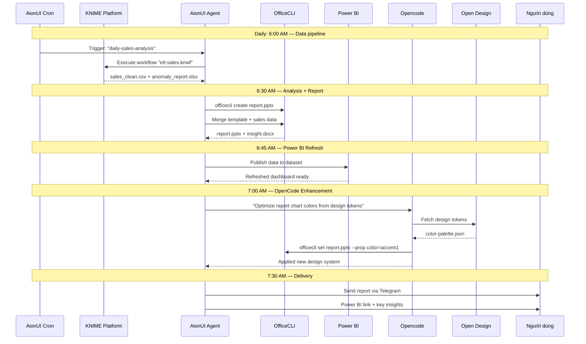

# AionUI — Phân Tích Tích Hợp Sâu Với Hệ Sinh Thái

> **Tài liệu này phân tích chi tiết các khả năng của AionUI khi làm việc tích sâu với Opencode, KNIME Data Analytics Platform, Open Design và Power BI Desktop — dựa trên mã nguồn và tài liệu kiến trúc chính thức của AionUI (https://github.com/iOfficeAI/AionUi, v2.1.9, Apache-2.0, 27.4k⭐).**

> 📘 **Tài liệu đi kèm**: Xem [KNIMEBI_AIONUI_OC_OD_MCP_GUIDE.md](./KNIMEBI_AIONUI_OC_OD_MCP_GUIDE.md) — Hướng dẫn chi tiết cài đặt MCP Server trung gian, thiết kế kiến trúc Unified Integration Hub, code Python mẫu, cấu hình AionUI, và Custom Skills cho cả 3 nền tảng.

---

## Mục Lục

- [1. Tổng Quan AionUI Platform](#1-tổng-quan-aionui-platform)
- [2. Kiến Trúc Mở Rộng & Cơ Chế Tích Hợp](#2-kiến-trúc-mở-rộng--cơ-chế-tích-hợp)
- [3. Tích Hợp Với Opencode](#3-tích-hợp-với-opencode)
- [4. Tích Hợp Với KNIME Data Analytics Platform](#4-tích-hợp-với-knime-data-analytics-platform)
- [5. Tích Hợp Với Open Design](#5-tích-hợp-với-open-design)
- [6. Tích Hợp Với Power BI Desktop](#6-tích-hợp-với-power-bi-desktop)
- [7. Kịch Bản Tương Tác Đa Nền Tảng](#7-kịch-bản-tương-tác-đa-nền-tảng)
- [8. Ma Trận Tích Hợp & Kiến Nghị](#8-ma-trận-tích-hợp--kiến-nghị)

---

## 1. Tổng Quan AionUI Platform

### 1.1. Định vị sản phẩm

AionUI là **nền tảng cộng tác (Cowork) đa AI Agent** mã nguồn mở, miễn phí, chạy trên desktop (Electron) với kiến trúc cho phép:

- **Chạy built-in AI agent** — không cần cài CLI tool, chỉ cần API key
- **Tích hợp 20+ CLI agents bên ngoài** — phát hiện tự động, giao diện thống nhất
- **Multi-Agent Team Mode** — điều phối nhiều agent với Leader/Teammate
- **Tự động hóa 24/7** — cron scheduling, WebUI remote access
- **Mở rộng qua 3 tầng skill** — Builtin, Custom, Extension
- **MCP (Model Context Protocol)** — quản lý tập trung, đồng bộ đến mọi agent

### 1.2. Stack công nghệ

```
Desktop:        Electron 37 + Vite 6 + React 19 + TypeScript 5.8
CSS:            UnoCSS + Arco Design
Package:        Bun (monorepo workspaces)
Database:       better-sqlite3 (SQLite local)
Mobile:         React Native / Expo
Office Engine:  OfficeCLI (.NET 10, single binary, embedded runtime)
Testing:        Vitest 4 + Playwright
CI/CD:          GitHub Actions, Codecov
```

### 1.3. Kiến trúc 3 tầng Agent ↔ Skill ↔ Tool/MCP

```
┌─────────────────────────────────────────────────────────────┐
│                      AionUI Desktop                         │
│  ┌──────────┐  ┌──────────┐  ┌──────────┐  ┌────────────┐  │
│  │ Built-in │  │ Opencode │  │ Claude   │  │ 20+ Agents │  │
│  │ Agent    │  │ (ACP)    │  │ Code     │  │ (auto-dect)│  │
│  └────┬─────┘  └────┬─────┘  └────┬─────┘  └──────┬─────┘  │
│       │             │             │               │        │
│  ┌────▼─────────────▼─────────────▼───────────────▼────┐   │
│  │           MCP Unified Management Layer              │   │
│  │  (configure once, sync to all agents)               │   │
│  └────────────────────┬────────────────────────────────┘   │
│                       │                                    │
│  ┌────────────────────▼────────────────────────────────┐   │
│  │  Skills System (3-tier)                             │   │
│  │  ┌─────────┐ ┌──────────┐ ┌──────────────┐         │   │
│  │  │ Builtin │ │  Custom  │ │  Extension   │         │   │
│  │  │ pptx    │ │  (user)  │ │  (3rd-party) │         │   │
│  │  │ docx    │ │          │ │              │         │   │
│  │  │ xlsx    │ │          │ │              │         │   │
│  │  └─────────┘ └──────────┘ └──────────────┘         │   │
│  └────────────────────┬────────────────────────────────┘   │
│                       │                                    │
│  ┌────────────────────▼────────────────────────────────┐   │
│  │  MCP Servers & External Tools (OfficeCLI, Playwright│   │
│  │  Filesystem, Git, CDP, Chrome DevTools, ...)        │   │
│  └─────────────────────────────────────────────────────┘   │
└─────────────────────────────────────────────────────────────┘
```

---

## 2. Kiến Trúc Mở Rộng & Cơ Chế Tích Hợp

### 2.1. Cơ chế tích hợp agent — ACP (Agent Communication Protocol)

ACP là giao thức điều phối đa agent của AionUI, dựa trên **JSON-RPC 2.0** qua stdin/stdout:

```
Handshake:  initialize → session/new → session/prompt
```

Cho phép bất kỳ CLI agent nào (trong đó có OpenCode) hoạt động như một backend Agent trong AionUI thông qua cơ chế auto-detect và ACP adapter.

### 2.2. Cơ chế tích hợp tool — MCP (Model Context Protocol)

AionUI hỗ trợ MCP làm lớp trừu tượng hóa tool:

- **Quản lý tập trung** — cấu hình MCP server 1 lần, đồng bộ đến mọi agent
- **Built-in MCP servers**: Team MCP Server, Playwright MCP, Puppeteer MCP, Filesystem MCP, Git MCP
- **CDP tích hợp** — Chrome DevTools Protocol cho debugging (port 9230)
- Custom MCP server có thể được viết bằng bất kỳ ngôn ngữ nào

### 2.3. Cơ chế tích hợp kỹ năng — 3-tier Skills System

| Tầng | Mô tả | Ví dụ |
|------|-------|-------|
| **Builtin** | Ship sẵn trong AionUI | pptx, docx, xlsx, pdf, mermaid |
| **Custom** | Do người dùng định nghĩa | KNIME workflow skill, Power BI skill |
| **Extension** | Đóng góp qua Extension SDK | star-office, feishu, wecom |

### 2.4. Cơ chế tích hợp văn phòng — OfficeCLI

OfficeCLI (https://github.com/iOfficeAI/OfficeCli) là engine xử lý Office document chuyên cho AI agent:

- Single binary (không cần cài Office)
- Agent-friendly output (JSON, line-oriented)
- Hỗ trợ .docx, .xlsx, .pptx — đọc/ghi/tạo/chỉnh sửa/validate
- Built-in rendering engine → HTML/PNG preview
- 150+ Excel formulas, Pivot Table, Chart
- Template merge `{{key}}`
- **MCP server tích hợp** — `officecli mcp claude | cursor | vscode | lmstudio`

### 2.5. Cơ chế tích hợp remote — WebUI + Chat Platform

```
AionUI Desktop
    ├── WebUI (port 25808) → browser/phone/tablet
    ├── Telegram Bot
    ├── Lark/Feishu Bot
    ├── DingTalk Bot
    ├── WeChat
    └── WeCom Bot
```

### 2.6. Cơ chế tự động hóa — Cron Scheduler

- Biểu thức cron 5-field + timezone
- Fixed interval (N phút/giờ)
- One-time trigger
- AI agent có thể tự tạo scheduled tasks
- Keep-awake + missed trigger detection

---

## 3. Tích Hợp Với Opencode

### 3.1. Hiện trạng

OpenCode (`opencode`) được AionUI liệt kê trong danh sách **20+ CLI agents được hỗ trợ** và xuất hiện trong repository description:

> "Free, local, open-source 24/7 Cowork app for OpenClaw, Hermes Agent, Claude Code, Codex, **OpenCode**, Gemini CLI and 20+ more CLI"

AionUI hỗ trợ OpenCode thông qua cơ chế **ACP (Agent Communication Protocol)** — phát hiện tự động CLI agent đã cài trên máy và tích hợp vào giao diện thống nhất.

### 3.2. Khả năng tích hợp cụ thể

| Khả năng | Chi tiết |
|----------|----------|
| **Auto Detection** | AionUI quét các CLI tool đã cài (bao gồm OpenCode) và tự động thêm vào danh sách agent |
| **Unified Interface** | OpenCode chạy trong cửa sổ AionUI với cùng cơ chế permission/approval như built-in agent |
| **Parallel Sessions** | Chạy OpenCode song song với các agent khác, mỗi session có context độc lập |
| **MCP Sharing** | MCP server cấu hình trong AionUI tự động sync đến OpenCode |
| **YOLO / Full-Auto Mode** | OpenCode có thể chạy không cần xác nhận thủ công (auto-approve) |
| **Team Mode** | OpenCode có thể làm Leader hoặc Teammate trong team multi-agent |

### 3.3. Kịch bản tương tác

**Kịch bản 1: OpenCode làm việc với built-in agent**

```
User: "Phân tích dữ liệu bán hàng và tạo báo cáo"
  ├── AionUI Built-in Agent: Đọc file Excel, phân tích số liệu
  ├── OpenCode: Gọi vào codebase, viết script phân tích nâng cao
  └── AionUI Agent: Dùng OfficeCLI xuất báo cáo .docx/.pptx
```

**Kịch bản 2: OpenCode trong Team Mode**

```
User: "Build full-stack app"
  ├── [Leader: OpenCode] Nhận task, phân rã subtask
  │   ├── [Teammate 1: Claude Code] Backend API
  │   ├── [Teammate 2: Built-in Agent] Tài liệu + testing
  │   └── [Teammate 3: Codex] Frontend components
  └── Leader tổng hợp kết quả
```

**Kịch bản 3: OpenCode + OfficeCLI**

```
OpenCode gọi officecli CLI để tạo document:
  $ officecli create report.docx
  $ officecli add report.docx /body --type paragraph --prop text="Analysis by OpenCode"
```

Hoặc qua MCP server:
```json
// OpenCode gọi MCP tool officecli
{
  "tool": "officecli_create",
  "args": { "path": "report.pptx" }
}
```

### 3.4. Lợi thế chiến lược

- AionUI cung cấp **UI desktop + WebUI + mobile** cho OpenCode — biến CLI-only thành full GUI
- **Scheduled tasks** cho phép OpenCode chạy tự động theo lịch (CI/CD pipeline)
- **MCP gateway** cho phép OpenCode truy cập filesystem, browser, git qua AionUI

---

## 4. Tích Hợp Với KNIME Data Analytics Platform

### 4.1. Hiện trạng

KNIME Analytics Platform **không có tích hợp sẵn** trong mã nguồn AionUI (v2.1.9). Tuy nhiên, kiến trúc mở rộng của AionUI cho phép tích hợp KNIME qua nhiều cơ chế.

### 4.2. Cơ chế tích hợp khả thi

#### 4.2.1. Qua MCP Server (ưu tiên)

Viết MCP server cho KNIME:

```
AionUI ──MCP──→ knime-mcp-server ──KNIME API──→ KNIME Analytics Platform
                                               ├── Execute workflow
                                               ├── Read/Write data tables
                                               ├── Export results (CSV/Excel/ARFF)
                                               └── Deploy to KNIME Server
```

**MCP Server đề xuất với các tool:**
- `knime_execute_workflow` — chạy KNIME workflow từ đường dẫn
- `knime_read_table` — đọc dữ liệu từ KNIME data table
- `knime_list_workflows` — liệt kê workflows
- `knime_export_results` — xuất kết quả ra formats (CSV, Excel, PMML)
- `knime_import_data` — import dữ liệu vào KNIME

#### 4.2.2. Qua Custom Skill

Tạo skill file `.md` cho KNIME:

```markdown
# Skill: knime-workflow

## Description
Execute and manage KNIME Analytics Platform workflows.

## Commands
- `knime execute <workflow.knwf>` — Run a workflow
- `knime read <table>` — Read output table
- `knime import <file> --type <csv|excel|json>` — Import to workflow
```

Đặt trong `~/.aionui/skills/knime-workflow.md`.

#### 4.2.3. Qua Extension SDK

Xây dựng extension KNIME đầy đủ (xem `examples/` trong AionUI repo):

```
ext-knime/
├── package.json          # manifest
├── main.ts               # IPC handlers
├── renderer.tsx          # UI components
├── skills/               # KNIME skill definitions
│   ├── knime-execute.md
│   └── knime-visualize.md
└── mcp-servers/
    └── knime-server.js
```

### 4.3. Lợi thế tích hợp

| Tính năng AionUI | Tương tác với KNIME |
|-----------------|---------------------|
| **Excel Creator** | Xuất dữ liệu KNIME → Excel, import ngược vào KNIME |
| **Dashboard Creator** | Tạo dashboard preview từ KNIME output |
| **OfficeCLI** | Chuyển KNIME output → báo cáo Word/PPT chuyên nghiệp |
| **Cron Scheduler** | Lên lịch chạy KNIME workflow định kỳ |
| **Preview Panel** | Xem trước KNIME output (CSV, Excel, hình ảnh) |
| **Multi-Agent** | Một agent chạy KNIME, agent khác phân tích kết quả |

### 4.4. Kịch bản cụ thể

**Kịch bản: Phân tích dữ liệu tự động**

```
1. Cron trigger (mỗi 24h)
2. AionUI agent chạy KNIME workflow "daily-sales.knwf"
3. KNIME xử lý: ETL → Transform → Aggregate → Model
4. KNIME xuất kết quả: data_table.csv + model.pmml
5. AionUI agent dùng OfficeCLI:
   - officecli merge daily-template.pptx result.pptx '{"sales": "data_table.csv"}'
6. Gửi báo cáo qua Telegram/Email
```

**Kịch bản: Iterative data analysis**

```
User: "Phân tích customer churn từ data warehouse"
  ├── AionUI agent gọi KNIME workflow "churn-analysis.knwf"
  ├── KNIME trả về data table + visualization
  ├── AionUI Preview Panel hiển thị kết quả
  └── User feedback → AionUI điều chỉnh tham số KNIME workflow
```

---

## 5. Tích Hợp Với Open Design

### 5.1. Hiện trạng

**Open Design** không phải là thuật ngữ hiện diện trong mã nguồn AionUI. Dưới đây phân tích theo hai nghĩa phổ biến:

- **Nghĩa 1**: Open Design như một platform/nền tảng thiết kế cụ thể
- **Nghĩa 2**: Open Design như một **phương pháp luận thiết kế mở** cho UI/UX

### 5.2. Tích hợp với nền tảng thiết kế (Figma, Penpot, etc.)

#### 5.2.1. Qua MCP

```
AionUI ──MCP──→ design-mcp-server ──API──→ Figma / Penpot / Open Design Platform
  ├── read_design_file
  ├── export_component
  ├── generate_design_tokens
  └── sync_design_system
```

**Tích hợp đặc thù với Dashboard Creator assistant:**
- AionUI có sẵn **Dashboard Creator** — sinh dashboard từ mô tả
- Kết quả có thể xuất dưới dạng HTML/CSS hoặc image
- Kết nối với design platform để lấy design tokens

#### 5.2.2. Với UI/UX Pro Max Assistant

AionUI có sẵn **UI/UX Pro Max** assistant với:
- 57 styles
- 95 color palettes
- Tạo giao diện người dùng chuyên nghiệp

Có thể mở rộng để xuất ra design system tokens tương thích Open Design (Design Tokens format chuẩn W3C DTCG).

### 5.3. Khả năng tùy biến CSS

AionUI hỗ trợ **custom CSS skin** — người dùng có thể tùy biến toàn bộ giao diện:

```
AionUI Settings → Custom CSS → inject styles
```

Cho phép áp dụng design system từ Open Design platform vào chính giao diện AionUI.

### 5.4. Kịch bản Open Design + AionUI

```
User: "Thiết kế dashboard cho sales team"
  ├── AionUI: Đọc design tokens từ Open Design platform (colors, spacing, typography)
  ├── Dashboard Creator: Sinh HTML dashboard theo tokens
  ├── UI/UX Pro Max: Tinh chỉnh layout, responsive
  ├── OfficeCLI: Xuất dashboard thành PPT/PDF
  └── Preview Panel: Hiển thị real-time kết quả
```

### 5.5. Design-to-code pipeline

```
[Open Design Components]
        │
        ▼
[Design Token Exporter] → tokens.json (W3C DTCG format)
        │
        ▼
[AionUI Custom Skill: design-system]
        │
        ▼
[AionUI UI/UX Pro Max Assistant]
        │
        ▼
[Generated Components: React/HTML/CSS]
```

---

## 6. Tích Hợp Với Power BI Desktop

### 6.1. Hiện trạng

Power BI Desktop **không có tích hợp sẵn** trong AionUI. Tuy nhiên, AionUI có các assistant và công cụ có thể đóng vai trò **bổ trợ** cho Power BI workflow.

### 6.2. Cơ chế tích hợp khả thi

#### 6.2.1. Data pipeline: AionUI → Power BI

```
[Nguồn dữ liệu (CSV, Excel, API, Database)]
        │
        ▼
[AionUI Agent + OfficeCLI]
  ├── Làm sạch dữ liệu (Excel Creator)
  ├── Phân tích sơ bộ (Excel formulas)
  ├── Tạo data model
  └── Xuất file .xlsx / .csv
        │
        ▼
[Power BI Desktop]
  ├── Import data từ file
  ├── Tạo visualization
  ├── Publish lên Power BI Service
  └── Schedule refresh
```

#### 6.2.2. Report pipeline: Power BI → AionUI

```
[Power BI Desktop]
  ├── Export to PDF (built-in)
  ├── Export to Excel (Analyze in Excel)
  └── Export data as CSV
        │
        ▼
[AionUI Agent + OfficeCLI]
  ├── Đọc dữ liệu từ Excel/CSV
  ├── Tạo báo cáo Word/PPT bổ sung
  ├── Merge với template định sẵn
  └── Gửi qua Telegram/Lark/Email
```

#### 6.2.3. Qua MCP Server

```
AionUI ──MCP──→ powerbi-mcp-server
  ├── powerbi_get_report — đọc thông tin report từ Power BI Service
  ├── powerbi_export_pdf — xuất report ra PDF
  ├── powerbi_get_dataset — lấy dataset
  ├── powerbi_refresh_dataset — refresh dataset
  └── powerbi_create_dashboard — tạo dashboard mới

# Yêu cầu: Power BI REST API + Service Principal / AAD auth
```

### 6.3. Tận dụng Dashboard Creator

AionUI có sẵn **Dashboard Creator assistant** — có thể sinh dashboard prototype nhanh từ dữ liệu:

```
User: "Tạo dashboard doanh số Q1"
  ├── AionUI agent: Đọc file sales.csv
  ├── Excel Creator: Phân tích, tạo pivot table, charts
  ├── Dashboard Creator: Sinh HTML dashboard interactive
  └── OfficeCLI pptx: Tạo PPTX dashboard cho presentation
```

Kết quả từ Dashboard Creator có thể dùng làm **mockup/prototype** trước khi xây dựng Power BI report chính thức.

### 6.4. Kịch bản Power BI + AionUI

**Kịch bản 1: Báo cáo định kỳ tự động**

```
[Cron: 8:00 AM mỗi Thứ Hai]
  ├── AionUI: Chạy KNIME/ETL workflow (nếu có)
  ├── AionUI: Xuất data lên Power BI dataset (qua REST API)
  ├── Power BI Service: Scheduled refresh
  └── AionUI: Power BI report → gửi summary qua Telegram/Lark
```

**Kịch bản 2: Phân tích dữ liệu kết hợp**

```
User: "Tại sao doanh số tháng này giảm?"
  ├── Power BI: Dashboard hiển thị trend giảm
  ├── Power BI: Export data detail ra CSV
  ├── AionUI agent:
  │   ├── Đọc CSV → Excel Creator → phân tích chi tiết
  │   ├── Gọi OfficeCLI: phân tích bằng Excel formulas
  │   └── Tạo báo cáo Word kèm insight
  └── User: Nhận báo cáo qua AionUI Preview Panel
```

**Kịch bản 3: Power BI Report từ data AionUI xử lý**

```
1. AionUI agent: Crawl web data / API → làm sạch → xuất Excel
2. User: Mở Power BI Desktop → Import Excel
3. Xây dựng visualization trong Power BI
4. Publish lên Power BI Service
5. AionUI cron: Refresh data định kỳ, Power BI service auto-refresh
```

---

## 7. Kịch Bản Tương Tác Đa Nền Tảng

### 7.1. Pipeline tích hợp tổng thể

```
┌─────────────────────────────────────────────────────────────────────┐
│                        KNIME Data Analytics                         │
│  ┌──────────────┐  ┌──────────────┐  ┌──────────────────────────┐  │
│  │ ETL Pipeline │  │ ML Training  │  │ Statistical Analysis     │  │
│  │ (workflows)  │  │ (models)     │  │ (output tables .csv/.xls)│  │
│  └──────┬───────┘  └──────┬───────┘  └───────────┬──────────────┘  │
│         │                 │                      │                 │
│         └─────────────────┴──────────────────────┘                 │
│                            │ KNIME Output                          │
└────────────────────────────┼────────────────────────────────────────┘
                             │
                             ▼
┌─────────────────────────────────────────────────────────────────────┐
│                         AionUI Platform                             │
│  ┌──────────────┐  ┌──────────────┐  ┌──────────────────────────┐  │
│  │ Agent Layer  │  │ Skills Layer │  │ MCP + OfficeCLI Layer    │  │
│  │ ┌──────────┐ │  │ ┌──────────┐ │  │ ┌──────────────────────┐│  │
│  │ │Opencode  │ │  │ │Data      │ │  │ │OfficeCLI → .docx     ││  │
│  │ │(ACP)     │ │  │ │Analysis  │ │  │ │          → .pptx     ││  │
│  │ │          │ │  │ │          │ │  │ │          → .xlsx     ││  │
│  │ │Built-in  │ │  │ │Dashboard │ │  │ │Power BI MCP → PBIDS  ││  │
│  │ │Agent     │ │  │ │(PRO)     │ │  │ │knime MCP → .knwf     ││  │
│  │ └──────────┘ │  │ └──────────┘ │  │ │Design MCP → tokens   ││  │
│  └──────────────┘  └──────────────┘  │ └──────────────────────┘│  │
│                                       └─────────────────────────┘  │
└──────────────────────┬─────────────────────────────────────────────┘
                       │
        ┌──────────────┼──────────────┐
        ▼              ▼              ▼
┌──────────────┐ ┌──────────────┐ ┌──────────────┐
│   Power BI   │ │ Open Design  │ │  Opencode    │
│   Desktop    │ │  Platform    │ │  Codebase    │
│   (Reports)  │ │  (UI/UX)     │ │  (Dev)       │
└──────────────┘ └──────────────┘ └──────────────┘
```

### 7.2. Kịch bản End-to-End: Tự động hóa phân tích kinh doanh



### 7.3. Ma trận tương tác cross-platform

| Component | KNIME | Power BI | Open Design | Opencode |
|-----------|-------|----------|-------------|----------|
| **AionUI Built-in Agent** | Orchestrate workflows | Push/pull data | Read tokens, gen UI | Task delegation |
| **Opencode (ACP)** | AI-enhanced analysis | Code visual mods | Design token integration | — |
| **OfficeCLI** | Export KNIME results →docx/pptx/xlsx | Build PPT from PBI data | Apply design to docs | Report formatting |
| **Dashboard Creator** | Visualize KNIME output | PBI dashboard mockup | Preview dashboard UI | Widget customization |
| **Excel Creator** | KNIME → Excel data | PBI dataset input | — | Data preprocessing |
| **Cron Scheduler** | Schedule KNIME workflows | Schedule PBI refresh | — | Scheduled code runs |
| **MCP Servers** | knime-mcp-server | powerbi-mcp-server | design-mcp-server | opencode-mcp-bridge |

---

## 8. Ma Trận Tích Hợp & Kiến Nghị

### 8.1. Tổng quan mức độ tích hợp

| Nền tảng | Mức độ hiện tại | Cơ chế khả dụng | Độ khó tích hợp | Ưu tiên |
|----------|-----------------|----------------|----------------|---------|
| **Opencode** | ✅ Có sẵn (ACP agent) | ACP, MCP, Auto-detect | Thấp — plug & play | **Cao** |
| **KNIME Analytics** | ❌ Chưa có | MCP server, Custom Skill, Extension SDK | Trung bình | **Cao** |
| **Power BI Desktop** | ❌ Chưa có | MCP server (qua REST API), Export/Import | Trung bình | **Trung bình** |
| **Open Design** | ❌ Chưa có | MCP server, Custom CSS, Design Token bridge | Trung bình - Cao | **Trung bình** |

### 8.2. Lộ trình kiến nghị

#### Giai đoạn 1: Tích hợp cơ bản (Ngắn hạn)

1. **Opencode**: Kích hoạt ACP auto-detect, cấu hình Team Mode
2. **KNIME**: Tạo custom skill cho KNIME CLI (`knime-cli` executor)
3. **Power BI**: Thiết lập data pipeline Excel → Power BI
4. **Open Design**: Đồng bộ design tokens qua Custom CSS skin

#### Giai đoạn 2: Tích hợp nâng cao (Trung hạn)

1. **KNIME MCP Server**: Xây dựng MCP server đầy đủ cho KNIME APIs
2. **Power BI MCP Server**: Xây dựng MCP server cho Power BI REST APIs
3. **AionUI Extension**: Đóng gói tích hợp dưới dạng extension chính thức
4. **Open Design Token Bridge**: Tự động đồng bộ token từ Figma/Penpot

#### Giai đoạn 3: Tự động hóa hoàn chỉnh (Dài hạn)

1. **Cross-platform pipeline**: KNIME → AionUI → Power BI → Open Design hoàn chỉnh
2. **AI-driven orchestration**: Agent tự động chọn workflow/platform phù hợp
3. **Shared context**: Memory/thông tin phân tích chia sẻ giữa các nền tảng

### 8.3. File cấu hình khuyến nghị

**components.json** — Định nghĩa tích hợp đa nền tảng:

```json
{
  "platforms": {
    "knime": {
      "type": "mcp",
      "mcpServer": "knime-mcp-server",
      "workflowsDir": "./knime-workflows",
      "schedule": "0 6 * * *"
    },
    "powerbi": {
      "type": "mcp",
      "mcpServer": "powerbi-mcp-server",
      "workspaceId": "...",
      "reports": ["sales-dashboard", "inventory-report"]
    },
    "opencode": {
      "type": "acp",
      "teamMode": true,
      "role": "leader"
    },
    "opendesign": {
      "type": "mcp",
      "mcpServer": "design-token-server",
      "tokenFormat": "w3c-dtcg"
    }
  }
}
```

---

## Phụ Lục

### A. Tài nguyên tham khảo

| Tài nguyên | URL |
|-----------|-----|
| AionUI Repository | https://github.com/iOfficeAI/AionUi |
| AionUI Website | https://www.aionui.com |
| OfficeCLI Repository | https://github.com/iOfficeAI/OfficeCli |
| OfficeCLI Website | https://officecli.ai |
| AionUI Wiki | https://github.com/iOfficeAI/AionUi/wiki |
| AionUI Community (Discord) | https://discord.gg/2QAwJn7Egx |

### B. Các file cấu hình và skill mẫu

Tất cả skill và cấu hình mẫu nên đặt trong thư mục `.aionui/` hoặc `skills/` của workspace:

```
.cowork/
├── components.json              # Cross-platform integration config
├── skills/
│   ├── knime-workflow.md        # KNIME skill
│   ├── powerbi-report.md        # Power BI skill
│   └── design-tokens.md         # Open Design token skill
├── mcp-servers/
│   ├── knime-mcp-server.js
│   └── powerbi-mcp-server.js
└── templates/
    ├── daily-report-template.pptx
    └── analysis-template.docx
```

### C. Các lưu ý kỹ thuật

1. **OfficeCLI rendering engine** hoạt động không cần Office — phù hợp headless/server
2. **ACP protocol** yêu cầu agent hỗ trợ JSON-RPC 2.0 qua stdin/stdout
3. **MCP servers** cần implement đúng MCP specification để AionUI auto-detect
4. **Power BI REST API** yêu cầu Azure AD app registration + Service Principal
5. **KNIME** có thể chạy headless qua `knime` CLI (KNIME Analytics Platform có batch mode)
6. **Design tokens** theo chuẩn W3C DTCG đảm bảo tương thích cross-platform

---

> **Tài liệu được tạo từ phân tích mã nguồn AionUI v2.1.9 và OfficeCLI v1.0.102.**  
> Một số nội dung tích hợp (KNIME, Power BI, Open Design) là đề xuất kiến trúc dựa trên cơ chế mở rộng của AionUI, chưa phải tích hợp sẵn có.

---

### D. Tài liệu liên quan

| Tài liệu | Mô tả |
|-----------|-------|
| [KNIMEBI_AIONUI_OC_OD_MCP_GUIDE.md](./KNIMEBI_AIONUI_OC_OD_MCP_GUIDE.md) | Thiết kế kiến trúc MCP Server trung gian, code Python mẫu, hướng dẫn cài đặt & cấu hình chi tiết, Custom Skills cho KNIME / Power BI / Open Design |
