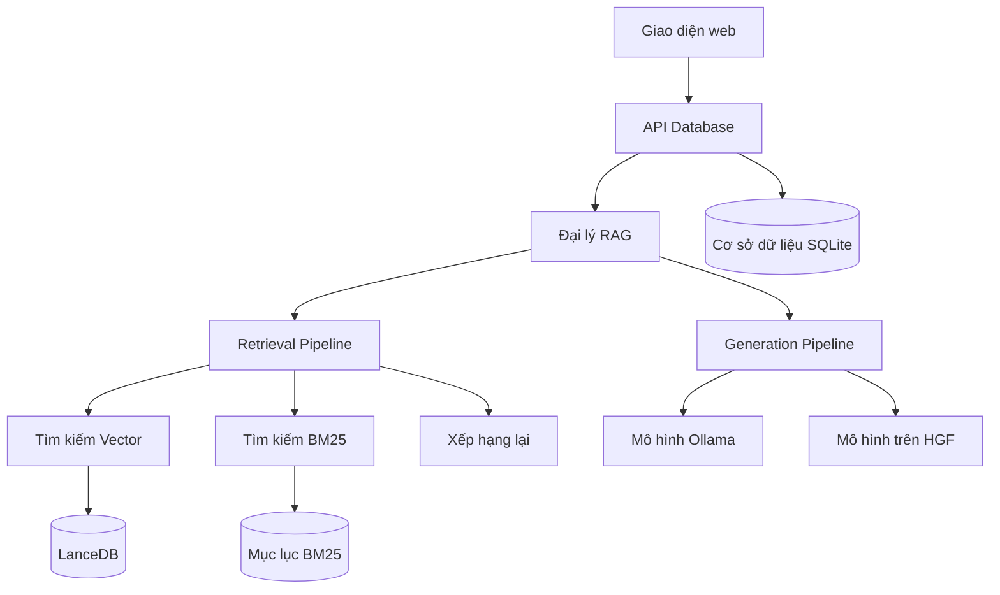
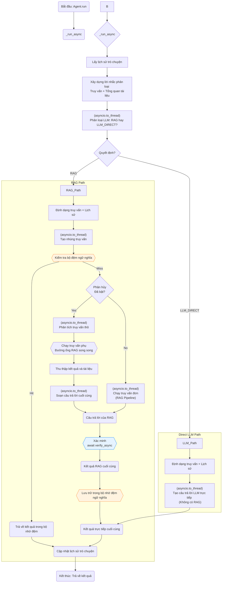

# Phần 1. Tại sao AI Private Local có hiệu suất cao?

# Phần 2. Trong AI Private Local mô hình làm chủ Front-end và AI Agent có AI Security an toàn cao?

# Phần 3. APL - Nền tảng thông tin tài liệu riêng tư?

## 🚀 APL là gì?
APL là nền tảng Document Intelligence hoàn toàn riêng tư, tại chỗ . 
Đặt câu hỏi, tóm tắt và khám phá thông tin chi tiết từ các tệp của bạn với AI tiên tiến—không có dữ liệu nào bị mất khỏi máy tính của bạn.

- Không chỉ là **một công cụ RAG (Retrieval-Augmented Generation - Thế hệ Tăng cường Truy xuất) truyền thống**, 
- APL còn **sở hữu một công cụ tìm kiếm lai kết hợp tính năng tương đồng ngữ nghĩa (syntax Fuzzy)**, 
- khớp từ khóa và **Late Chunking để đạt độ chính xác ngữ cảnh dài (Long Context)**. 
- Một bộ định tuyến thông minh sẽ tự động lựa chọn giữa RAG và LLM trả lời trực tiếp cho mọi truy vấn (AI routing Proxy), trong khi tính năng làm giàu ngữ cảnh và 
 -Cắt tỉa Ngữ cảnh cấp câu chỉ hiển thị nội dung phù hợp nhất. 
- Một bước xác minh độc lập sẽ tăng thêm độ chính xác.

**Kiến trúc mô-đun và gọn nhẹ** — chỉ hỗ trợ các thành phần bạn cần. 
- Với lõi Python thuần túy và các phụ thuộc tối thiểu, APL dễ dàng triển khai, chạy và bảo trì trên mọi cơ sở hạ tầng. 
- Hệ thống có ít phụ thuộc vào các framework và thư viện, giúp việc triển khai và bảo trì dễ dàng. 
- Hệ thống RAG là Python thuần túy và không yêu cầu bất kỳ phụ thuộc bổ sung nào.

▶️Băng hình
Xem video (https://youtu.be/JTbtGH3secI) này để bắt đầu sử dụng APL.

Trang chủ	


Tạo Mô hình APL mới:	


Trò chuyện


## ✨ Tính năng
1. Quyền riêng tư tối đa : Dữ liệu của bạn được lưu trên máy tính, đảm bảo an toàn 100%.
2. Hỗ trợ mô hình đa năng : Tích hợp liền mạch nhiều mô hình nguồn mở thông qua Ollama.
3. Nhiều loại nhúng : Chọn từ nhiều loại nhúng mã nguồn mở.
4. Tái sử dụng LLM của bạn : Sau khi tải xuống, bạn có thể tái sử dụng LLM mà không cần phải tải xuống nhiều lần.
5. Lịch sử trò chuyện : Ghi nhớ các cuộc trò chuyện trước đó của bạn (trong một phiên).
6. API : APL có API mà bạn có thể sử dụng để xây dựng Ứng dụng RAG.
7. Hỗ trợ GPU, CPU, HPU & MPS : Hỗ trợ nhiều nền tảng ngay khi cài đặt, Trò chuyện với dữ liệu của bạn bằng CUDA, CPU, HPU (Intel® Gaudi®)hoặc MPSvà nhiều hơn nữa!
   
## 📖 Xử lý tài liệu
1. Hỗ trợ nhiều định dạng : PDF, DOCX, TXT, Markdown và nhiều định dạng khác (Hiện tại chỉ hỗ trợ PDF)
2. Làm giàu theo ngữ cảnh : Nâng cao khả năng hiểu tài liệu với ngữ cảnh do AI tạo ra, lấy cảm hứng từ Truy xuất theo ngữ cảnh
3. Xử lý hàng loạt : Xử lý nhiều tài liệu cùng lúc
   
## 🤖 Trò chuyện hỗ trợ AI
1. Truy vấn ngôn ngữ tự nhiên : Đặt câu hỏi bằng tiếng Anh đơn giản
2. Ghi rõ nguồn : Mỗi câu trả lời đều bao gồm tài liệu tham khảo
3. Định tuyến thông minh : Tự động lựa chọn giữa phản hồi RAG và LLM trực tiếp
4. Phân tích truy vấn : Chia các truy vấn phức tạp thành các câu hỏi phụ để có câu trả lời tốt hơn
5. Bộ nhớ đệm ngữ nghĩa : Bộ nhớ đệm dựa trên TTL với khả năng khớp tương tự để phản hồi nhanh hơn
6. Lịch sử nhận biết phiên : Duy trì ngữ cảnh hội thoại trong suốt các tương tác
7. Xác minh câu trả lời : Xác minh độc lập để đảm bảo độ chính xác
8. Nhiều mô hình AI : Ollama để suy luận, HuggingFace để nhúng và xếp hạng lại

## 🛠️ Thân thiện với nhà phát triển
1. API RESTful : Truy cập API hoàn chỉnh để tích hợp
2. Tiến độ thời gian thực : Cập nhật trực tiếp trong quá trình xử lý tài liệu
3. Cấu hình linh hoạt : Tùy chỉnh mô hình, kích thước khối và tham số tìm kiếm
4. Kiến trúc mở rộng : Hệ thống plugin cho các thành phần tùy chỉnh

## 🎨 Giao diện hiện đại
1. Giao diện người dùng web trực quan : Thiết kế gọn gàng, đáp ứng nhanh
2. Quản lý phiên : Tổ chức các cuộc trò chuyện theo chủ đề
3. Quản lý chỉ mục : Quản lý bộ sưu tập tài liệu dễ dàng
4. Trò chuyện thời gian thực : Truyền phát phản hồi để nhận phản hồi ngay lập tức

## 🚀 Bắt đầu nhanh
Lưu ý: Hiện tại quá trình cài đặt chỉ được thử nghiệm trên macOS.

## Điều kiện tiên quyết:
1. Python 3.8 trở lên (đã thử nghiệm với Python 3.11.5)
2. Node.js 16+ và npm (đã thử nghiệm với Node.js 23.10.0, npm 10.9.2)
3. Docker (tùy chọn, để triển khai trong container)
4. RAM 8GB+ (khuyến nghị 16GB+)
5. Ollama (bắt buộc cho cả hai cách triển khai)

## GHI CHÚ:
- Trước khi nhánh này được di chuyển đến nhánh chính, vui lòng sao chép nhánh này để cài đặt:
```
git clone -b APL-v2 https://github.com/PromtEngineer/localGPT.git
cd localGPT
```
## Tùy chọn 1: Triển khai Docker
```
# Clone the repository
git clone https://github.com/PromtEngineer/localGPT.git
cd localGPT

# Install Ollama locally (required even for Docker)
curl -fsSL https://ollama.ai/install.sh | sh
ollama pull qwen3:0.6b
ollama pull qwen3:8b

# Start Ollama
ollama serve

# Start with Docker (in a new terminal)
./start-docker.sh

# Access the application
open http://localhost:3000
```
## Lệnh quản lý Docker:
```
# Check container status
docker compose ps

# View logs
docker compose logs -f

# Stop containers
./start-docker.sh stop
```

## Lựa chọn 2: Phát triển trực tiếp (Khuyến nghị phát triển)
```
# Clone the repository
git clone https://github.com/PromtEngineer/localGPT.git
cd localGPT

# Install Python dependencies
pip install -r requirements.txt

# Key dependencies installed:
# - torch==2.4.1, transformers==4.51.0 (AI models)
# - lancedb (vector database)
# - rank_bm25, fuzzywuzzy (search algorithms)
# - sentence_transformers, rerankers (embedding/reranking)
# - docling (document processing)
# - colpali-engine (multimodal processing - support coming soon)

# Install Node.js dependencies
npm install

# Install and start Ollama
curl -fsSL https://ollama.ai/install.sh | sh
ollama pull qwen3:0.6b
ollama pull qwen3:8b
ollama serve

# Start the system (in a new terminal)
python run_system.py

# Access the application
open http://localhost:3000
```
## Quản lý hệ thống:
```
# Check system health (comprehensive diagnostics)
python system_health_check.py

# Check service status and health
python run_system.py --health

# Start in production mode
python run_system.py --mode prod

# Skip frontend (backend + RAG API only)
python run_system.py --no-frontend

# View aggregated logs
python run_system.py --logs-only

# Stop all services
python run_system.py --stop
# Or press Ctrl+C in the terminal running python run_system.py
```
## Kiến trúc dịch vụ: Trình run_system.pykhởi chạy quản lý bốn dịch vụ chính:
1. Máy chủ Ollama (cổng 11434): Phục vụ mô hình AI
2. Máy chủ API RAG (cổng 8001): Xử lý và truy xuất tài liệu
3. Máy chủ phụ trợ (cổng 8000): Quản lý phiên và điểm cuối API
4. Máy chủ Frontend (cổng 3000): Giao diện web React/Next.js

## Tùy chọn 3: Khởi động thành phần thủ công
```
# Terminal 1: Start Ollama
ollama serve

# Terminal 2: Start RAG API
python -m rag_system.api_server

# Terminal 3: Start Backend
cd backend && python server.py

# Terminal 4: Start Frontend
npm run dev

# Access at http://localhost:3000
```

## Cài đặt chi tiết
1. Cài đặt các phụ thuộc hệ thống
Ubuntu/Debian:
```
sudo apt update
sudo apt install python3.8 python3-pip nodejs npm docker.io docker-compose
```
macOS:
```
brew install python@3.8 node npm docker docker-compose
```
Cửa sổ:
```
# Install Python 3.8+, Node.js, and Docker Desktop
# Then use PowerShell or WSL2
```
2. Cài đặt mô hình AI
Cài đặt Ollama (Khuyến nghị):
```
# Install Ollama
curl -fsSL https://ollama.ai/install.sh | sh

# Pull recommended models
ollama pull qwen3:0.6b          # Fast generation model
ollama pull qwen3:8b            # High-quality generation model
```
3. Cấu hình môi trường
```
# Copy environment template
cp .env.example .env

# Edit configuration
nano .env
```
Tùy chọn cấu hình chính:
```
# AI Models (referenced in rag_system/main.py)
OLLAMA_HOST=http://localhost:11434

# Database Paths (used by backend and RAG system)
DATABASE_PATH=./backend/chat_data.db
VECTOR_DB_PATH=./lancedb

# Server Settings (used by run_system.py)
BACKEND_PORT=8000
FRONTEND_PORT=3000
RAG_API_PORT=8001

# Optional: Override default models
GENERATION_MODEL=qwen3:8b
ENRICHMENT_MODEL=qwen3:0.6b
EMBEDDING_MODEL=Qwen/Qwen3-Embedding-0.6B
RERANKER_MODEL=answerdotai/answerai-colbert-small-v1
```
4. Khởi tạo hệ thống
```
# Run system health check
python system_health_check.py

# Initialize databases
python -c "from backend.database import ChatDatabase; ChatDatabase().init_database()"

# Test installation
python -c "from rag_system.main import get_agent; print('✅ Installation successful!')"

# Validate complete setup
python run_system.py --health
```

---

## 🎯 Bắt đầu
### 1. Tạo chỉ mục đầu tiên của bạn
Chỉ mục là tập hợp các tài liệu đã xử lý mà bạn có thể trò chuyện.

Sử dụng Giao diện Web:
1. Mở http://localhost:3000
2. Nhấp vào "Tạo chỉ mục mới"
3. Tải lên tài liệu của bạn (PDF, DOCX, TXT)
4. Cấu hình tùy chọn xử lý
5. Nhấp vào "Xây dựng chỉ mục"
Sử dụng tập lệnh:
```
# Simple script approach
./simple_create_index.sh "My Documents" "path/to/document.pdf"

# Interactive script
python create_index_script.py
```
Sử dụng API:
```
# Create index
curl -X POST http://localhost:8000/indexes \
  -H "Content-Type: application/json" \
  -d '{"name": "My Index", "description": "My documents"}'

# Upload documents
curl -X POST http://localhost:8000/indexes/INDEX_ID/upload \
  -F "files=@document.pdf"

# Build index
curl -X POST http://localhost:8000/indexes/INDEX_ID/build
```
### 2. Bắt đầu trò chuyện
Sau khi chỉ mục của bạn được xây dựng:
1. Tạo phiên trò chuyện : Nhấp vào "Trò chuyện mới" hoặc sử dụng phiên trò chuyện hiện có
2. Chọn chỉ mục của bạn : Chọn bộ sưu tập tài liệu để truy vấn
3. Đặt câu hỏi : Nhập câu hỏi bằng ngôn ngữ tự nhiên về tài liệu của bạn
4. Nhận câu trả lời : Nhận phản hồi do AI tạo ra kèm theo trích dẫn nguồn

### 3. Tính năng nâng cao
Cấu hình mô hình tùy chỉnh:
```
# Use different models for different tasks
curl -X POST http://localhost:8000/sessions \
  -H "Content-Type: application/json" \
  -d '{
    "title": "High Quality Session",
    "model": "qwen3:8b",
    "embedding_model": "Qwen/Qwen3-Embedding-4B"
  }'
```
Xử lý tài liệu hàng loạt
```
# Process multiple documents at once
python demo_batch_indexing.py --config batch_indexing_config.json
```

Tích hợp API:
```
import requests

# Chat with your documents via API
response = requests.post('http://localhost:8000/chat', json={
    'query': 'What are the key findings in the research papers?',
    'session_id': 'your-session-id',
    'search_type': 'hybrid',
    'retrieval_k': 20
})

print(response.json()['response'])
```
## 🔧 Cấu hình
### Cấu hình mô hình

APL hỗ trợ nhiều nhà cung cấp mô hình AI với cấu hình tập trung:
#### 1. Mô hình Ollama (Suy luận cục bộ)
```
OLLAMA_CONFIG = {
    "host": "http://localhost:11434",
    "generation_model": "qwen3:8b",        # Main text generation
    "enrichment_model": "qwen3:0.6b"       # Lightweight routing/enrichment
}
```
#### Mô hình mẫu bên ngoài (HuggingFace Direct)
```
EXTERNAL_MODELS = {
    "embedding_model": "Qwen/Qwen3-Embedding-0.6B",           # 1024 dimensions
    "reranker_model": "answerdotai/answerai-colbert-small-v1", # ColBERT reranker
    "fallback_reranker": "BAAI/bge-reranker-base"             # Backup reranker
}
```
#### Cấu hình đường ống:
APL cung cấp hai cấu hình đường ống chính:

Đường ống mặc định (Sẵn sàng sản xuất)
```
"default": {
    "description": "Production-ready pipeline with hybrid search, AI reranking, and verification",
    "storage": {
        "lancedb_uri": "./lancedb",
        "text_table_name": "text_pages_v3",
        "bm25_path": "./index_store/bm25"
    },
    "retrieval": {
        "retriever": "multivector",
        "search_type": "hybrid",
        "late_chunking": {"enabled": True},
        "dense": {"enabled": True, "weight": 0.7},
        "bm25": {"enabled": True}
    },
    "reranker": {
        "enabled": True,
        "type": "ai",
        "strategy": "rerankers-lib",
        "model_name": "answerdotai/answerai-colbert-small-v1",
        "top_k": 10
    },
    "query_decomposition": {"enabled": True, "max_sub_queries": 3},
    "verification": {"enabled": True},
    "retrieval_k": 20,
    "contextual_enricher": {"enabled": True, "window_size": 1}
}
```
#### Đường ống nhanh (Tối ưu hóa tốc độ)
```
"fast": {
    "description": "Speed-optimized pipeline with minimal overhead",
    "retrieval": {
        "search_type": "vector_only",
        "late_chunking": {"enabled": False}
    },
    "reranker": {"enabled": False},
    "query_decomposition": {"enabled": False},
    "verification": {"enabled": False},
    "retrieval_k": 10,
    "contextual_enricher": {"enabled": False}
}
```
#### Cấu hình tìm kiếm:
```
SEARCH_CONFIG = {
    'hybrid': {
        'dense_weight': 0.7,
        'sparse_weight': 0.3,
        'retrieval_k': 20,
        'reranker_top_k': 10
    }
}
```
## 🛠️ Khắc phục sự cố:
### Các vấn đề chung:
#### Sự cố cài đặt:
```
# Check Python version
python --version  # Should be 3.8+

# Check dependencies
pip list | grep -E "(torch|transformers|lancedb)"

# Reinstall dependencies
pip install -r requirements.txt --force-reinstall
```
#### Các vấn đề tải mô hình
```
# Check Ollama status
ollama list
curl http://localhost:11434/api/tags

# Pull missing models
ollama pull qwen3:0.6b
```
#### Các vấn đề về cơ sở dữ liệu
```
# Check database connectivity
python -c "from backend.database import ChatDatabase; db = ChatDatabase(); print('✅ Database OK')"

# Reset database (WARNING: This deletes all data)
rm backend/chat_data.db
python -c "from backend.database import ChatDatabase; ChatDatabase().init_database()"
```
#### Các vấn đề về hiệu suất
```
# Check system resources
python system_health_check.py

# Monitor memory usage
htop  # or Task Manager on Windows

# Optimize for low-memory systems
export PYTORCH_CUDA_ALLOC_CONF=max_split_size_mb:512
```

### Nhận trợ giúp
**1. Kiểm tra Nhật ký** : Hệ thống tạo nhật ký có cấu trúc trong logs/thư mục:

- logs/system.log: Các sự kiện và lỗi hệ thống chính
- logs/ollama.log: Nhật ký máy chủ Ollama
- logs/rag-api.log: Nhật ký xử lý API RAG
- logs/backend.log: Nhật ký máy chủ phụ trợ
- logs/frontend.log: Nhật ký xây dựng và thời gian chạy giao diện người dùng

**2. Sức khỏe hệ thống**: Chạy chẩn đoán toàn diện:
```
python system_health_check.py  # Full system diagnostics
python run_system.py --health  # Service status check
```
**3. Điểm cuối về tình trạng sức khỏe :** Kiểm tra tình trạng sức khỏe của từng dịch vụ:

- Phần cuối:http://localhost:8000/health
- API RAG:http://localhost:8001/health
- Ollama:http://localhost:11434/api/tags

**4. Tài liệu : Kiểm tra Tài liệu Kỹ thuật**: https://github.com/PromtEngineer/localGPT/blob/main/TECHNICAL_DOCS.md 

**5. Sự cố GitHub :** Báo cáo lỗi và yêu cầu tính năng

**6. Cộng đồng :** Tham gia cộng đồng Discord/Slack của chúng tôi

---

# 🔗 Tài liệu tham khảo API
## Điểm cuối cốt lõi
### API trò chuyện
```
# Session-based chat (recommended)
POST /sessions/{session_id}/chat
Content-Type: application/json

{
  "query": "What are the main topics discussed?",
  "search_type": "hybrid",
  "retrieval_k": 20,
  "ai_rerank": true,
  "context_window_size": 5
}

# Legacy chat endpoint
POST /chat
Content-Type: application/json

{
  "query": "What are the main topics discussed?",
  "session_id": "uuid",
  "search_type": "hybrid",
  "retrieval_k": 20
}
```
### Quản lý chỉ mục:
```
# Create index
POST /indexes
Content-Type: application/json
{
  "name": "My Index",
  "description": "Description",
  "config": "default"
}

# Get all indexes
GET /indexes

# Get specific index
GET /indexes/{id}

# Upload documents to index
POST /indexes/{id}/upload
Content-Type: multipart/form-data
files: [file1.pdf, file2.pdf, ...]

# Build index (process uploaded documents)
POST /indexes/{id}/build
Content-Type: application/json
{
  "config_mode": "default",
  "enable_enrich": true,
  "chunk_size": 512
}

# Delete index
DELETE /indexes/{id}
```
### Quản lý phiên:
```
# Create session
POST /sessions
Content-Type: application/json
{
  "title": "My Session",
  "model": "qwen3:0.6b"
}

# Get all sessions
GET /sessions

# Get specific session
GET /sessions/{session_id}

# Get session documents
GET /sessions/{session_id}/documents

# Get session indexes
GET /sessions/{session_id}/indexes

# Link index to session
POST /sessions/{session_id}/indexes/{index_id}

# Delete session
DELETE /sessions/{session_id}

# Rename session
POST /sessions/{session_id}/rename
Content-Type: application/json
{
  "new_title": "Updated Session Name"
}
```

### Tính năng nâng cao
#### Phân tích truy vấn
Hệ thống có thể chia các truy vấn phức tạp thành các câu hỏi nhỏ hơn để có câu trả lời tốt hơn:
```
POST /sessions/{session_id}/chat
Content-Type: application/json

{
  "query": "Compare the methodologies and analyze their effectiveness",
  "query_decompose": true,
  "compose_sub_answers": true
}
```
#### Xác minh câu trả lời
Xác minh độc lập về độ chính xác bằng cách sử dụng mô hình xác minh riêng biệt:
```
POST /sessions/{session_id}/chat
Content-Type: application/json

{
  "query": "What are the key findings?",
  "verify": true
}
```
#### Làm giàu ngữ cảnh
Làm giàu ngữ cảnh tài liệu trong quá trình lập chỉ mục để hiểu rõ hơn:
```
# Enable during index building
POST /indexes/{id}/build
{
  "enable_enrich": true,
  "window_size": 2
}
```
#### Phân đoạn muộn
Bảo toàn ngữ cảnh tốt hơn bằng cách phân đoạn sau khi nhúng:
```
# Configure in pipeline
"late_chunking": {"enabled": true}
```
#### Trò chuyện trực tuyến
```
POST /chat/stream
Content-Type: application/json

{
  "query": "Explain the methodology",
  "session_id": "uuid",
  "stream": true
}
```
#### Xử lý hàng loạt
```
# Using the batch indexing script
python demo_batch_indexing.py --config batch_indexing_config.json

# Example batch configuration (batch_indexing_config.json):
{
  "index_name": "Sample Batch Index",
  "index_description": "Example batch index configuration",
  "documents": [
    "./rag_system/documents/invoice_1039.pdf",
    "./rag_system/documents/invoice_1041.pdf"
  ],
  "processing": {
    "chunk_size": 512,
    "chunk_overlap": 64,
    "enable_enrich": true,
    "enable_latechunk": true,
    "enable_docling": true,
    "embedding_model": "Qwen/Qwen3-Embedding-0.6B",
    "generation_model": "qwen3:0.6b",
    "retrieval_mode": "hybrid",
    "window_size": 2
  }
}
```
```
# API endpoint for batch processing
POST /batch/index
Content-Type: application/json

{
  "file_paths": ["doc1.pdf", "doc2.pdf"],
  "config": {
    "chunk_size": 512,
    "enable_enrich": true,
    "enable_latechunk": true,
    "enable_docling": true
  }
}
```
Để biết tài liệu API đầy đủ, hãy xem API_REFERENCE.md : https://github.com/PromtEngineer/localGPT/blob/main/API_REFERENCE.md.

# 🏗️ Kiến trúc
APL được xây dựng theo kiến trúc mô-đun, có khả năng mở rộng:


Tổng quan về tác nhân truy xuất



# 🤝 Đóng góp:
Chúng tôi hoan nghênh sự đóng góp từ các nhà phát triển ở mọi trình độ! APL là một dự án nguồn mở được hưởng lợi từ sự tham gia của cộng đồng.

## 🚀 Bắt đầu nhanh cho Người đóng góp
```
# Fork and clone the repository
git clone https://github.com/PromtEngineer/APL.git
cd APL

# Set up development environment
pip install -r requirements.txt
npm install

# Install Ollama and models
curl -fsSL https://ollama.ai/install.sh | sh
ollama pull qwen3:0.6b qwen3:8b

# Verify setup
python system_health_check.py
python run_system.py --mode dev
```
### 📋 Cách đóng góp
1. 🐛 Báo cáo lỗi : Sửdụng mẫu báo cáo lỗi của chúng tôi https://github.com/PromtEngineer/localGPT/blob/main/.github/ISSUE_TEMPLATE/bug_report.md
2. 💡 Yêu cầu tính năng : Sử dụng mẫu yêu cầu tính năng của chúng tôi https://github.com/PromtEngineer/localGPT/blob/main/.github/ISSUE_TEMPLATE/feature_request.md
3. 🔧 Gửi mã : Theo dõi quy trình phát triển của chúng tôi: https://github.com/PromtEngineer/localGPT/blob/main/CONTRIBUTING.md#development-workflow
4. 📚 Cải thiện Tài liệu : Giúp cải thiện tài liệu của chúng tôi

### 📖 Hướng dẫn chi tiết
Để biết hướng dẫn đóng góp toàn diện, bao gồm:

1. Thiết lập phát triển và quy trình làm việc
2. Tiêu chuẩn mã hóa và thực hành tốt nhất
3. Yêu cầu thử nghiệm
4. Tiêu chuẩn tài liệu
5. Quá trình phát hành
👉 Xem hướng dẫn CONTRIBUTING.md của chúng tôi: https://github.com/PromtEngineer/localGPT/blob/main/CONTRIBUTING.md

### 📄 Giấy phép
Dự án này được cấp phép theo Giấy phép MIT - xem tệp LICENSE https://github.com/PromtEngineer/localGPT/blob/main/LICENSE để biết chi tiết. 
Đối với các mô hình, vui lòng kiểm tra giấy phép tương ứng.

### 📞 Hỗ trợ
1. Tài liệu : Tài liệu kỹ thuật: https://github.com/PromtEngineer/localGPT/blob/main/TECHNICAL_DOCS.md
2. Các vấn đề : Các vấn đề của GitHub: https://github.com/PromtEngineer/localGPT/issues
3. Thảo luận : Thảo luận GitHub: https://github.com/PromtEngineer/localGPT/discussions
4. Triển khai và tùy chỉnh doanh nghiệp : Liên hệ với chúng tôi: https://tally.so/r/wv6R2d
#### Lịch sử ngôi sao: star-history.com 
