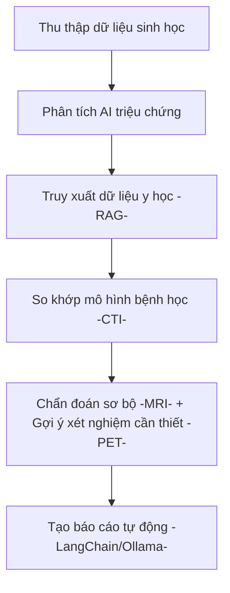
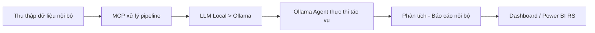

# Phần. 1: Khái niệm về AI-ML-DL:
>> Giúp tôi giới thiệu, Khái niệm, chi tiết so sánh mục đích, mục tiêu, chức năng, lợi thế, nhược điểm và ứng dụng của các mô hình AI: RAG, MCP,n8n, KNIME K-AI, FineTune cho LLM Local, Ollama 3.2:1b local, ollama Agent, Python 3.11 Jupyter notebook với LLM, LangChain LLM local ?
>>

Dưới đây là phần giới thiệu và so sánh chi tiết các mô hình và công cụ AI mà bạn đã liệt kê, bao gồm khái niệm, mục đích, chức năng, lợi thế, nhược điểm và ứng dụng:

---

## 🔍 **1. RAG (Retrieval-Augmented Generation)**

- **Khái niệm**: Kết hợp mô hình ngôn ngữ lớn (LLM) với hệ thống truy xuất thông tin để tạo ra phản hồi chính xác hơn [1](https://aichatbot.com.vn/rag-ai-agent-and-agentic-rag-danh-gia-chuyen-sau-va-phan-tich-so-sanh-cac-he-thong-ai-thong-minh/).
- **Mục đích**: Giảm hiện tượng "ảo giác" của LLM bằng cách truy xuất dữ liệu thực tế.
- **Chức năng**: Truy xuất tài liệu liên quan → tạo phản hồi dựa trên tài liệu đó.
- **Lợi thế**: Cập nhật thông tin theo thời gian thực, phù hợp ngữ cảnh.
- **Nhược điểm**: Phụ thuộc vào chất lượng dữ liệu truy xuất.
- **Ứng dụng**: Trợ lý khách hàng, y tế, nghiên cứu học thuật.

---

## 🧠 **2. MCP (Multi-Component Pipeline)**

- **Khái niệm**: Kiến trúc AI gồm nhiều thành phần xử lý tuần tự hoặc song song.
- **Mục đích**: Tối ưu hóa quy trình xử lý dữ liệu phức tạp.
- **Chức năng**: Phân tích, tiền xử lý, suy luận, tổng hợp.
- **Lợi thế**: Linh hoạt, dễ mở rộng.
- **Nhược điểm**: Phức tạp trong triển khai và bảo trì.
- **Ứng dụng**: Hệ thống AI doanh nghiệp, phân tích dữ liệu lớn.

---

## 🔄 **3. n8n**

- **Khái niệm**: Nền tảng tự động hóa quy trình làm việc mã nguồn mở.
- **Mục đích**: Tích hợp và tự động hóa giữa các dịch vụ web/API.
- **Chức năng**: Kéo-thả workflow, tích hợp với LLM qua API.
- **Lợi thế**: Mã nguồn mở, dễ tùy chỉnh.
- **Nhược điểm**: Cần kiến thức kỹ thuật để mở rộng.
- **Ứng dụng**: Tự động hóa tác vụ AI, tích hợp LLM vào hệ thống.

---

## 🧬 **4. KNIME K-AI**

- **Khái niệm**: KNIME là nền tảng phân tích dữ liệu, K-AI là module AI tích hợp.
- **Mục đích**: Phân tích dữ liệu và triển khai AI không cần viết mã.
- **Chức năng**: Xử lý dữ liệu, huấn luyện mô hình, tích hợp LLM.
- **Lợi thế**: Giao diện trực quan, hỗ trợ nhiều định dạng dữ liệu.
- **Nhược điểm**: Giới hạn về hiệu suất với dữ liệu lớn.
- **Ứng dụng**: Phân tích dữ liệu doanh nghiệp, AI không mã.

---

## 🧪 **5. Fine-Tune cho LLM Local**

- **Khái niệm**: Tinh chỉnh mô hình ngôn ngữ lớn trên dữ liệu riêng.
- **Mục đích**: Tăng độ chính xác và phù hợp với ngữ cảnh cụ thể.
- **Chức năng**: Huấn luyện lại mô hình với dữ liệu tùy chỉnh.
- **Lợi thế**: Kiểm soát dữ liệu, bảo mật cao.
- **Nhược điểm**: Tốn tài nguyên, cần kiến thức chuyên sâu.
- **Ứng dụng**: Chatbot nội bộ, phân tích văn bản chuyên ngành.

---

## 🧠 **6. Ollama 3.2:1b Local**

- **Khái niệm**: Mô hình LLM nhẹ chạy cục bộ trên máy tính cá nhân.
- **Mục đích**: Triển khai AI mà không cần kết nối internet.
- **Chức năng**: Tạo văn bản, trả lời câu hỏi, hỗ trợ lập trình.
- **Lợi thế**: Bảo mật, không phụ thuộc đám mây.
- **Nhược điểm**: Giới hạn về kích thước và khả năng mô hình.
- **Ứng dụng**: Trợ lý cá nhân, ứng dụng AI ngoại tuyến.

---

## 🤖 **7. Ollama Agent**

- **Khái niệm**: Tác nhân AI sử dụng mô hình Ollama để thực hiện tác vụ.
- **Mục đích**: Tự động hóa quy trình thông minh.
- **Chức năng**: Giao tiếp, ra quyết định, thực hiện hành động.
- **Lợi thế**: Tích hợp dễ dàng với hệ thống cục bộ.
- **Nhược điểm**: Cần cấu hình chi tiết để hoạt động hiệu quả.
- **Ứng dụng**: Trợ lý AI, tự động hóa công việc.

---

## 📓 **8. Python 3.11 + Jupyter Notebook với LLM**

- **Khái niệm**: Môi trường lập trình tương tác kết hợp với LLM.
- **Mục đích**: Phân tích dữ liệu, thử nghiệm AI.
- **Chức năng**: Viết mã, chạy mô hình, trực quan hóa kết quả.
- **Lợi thế**: Tùy biến cao, cộng đồng lớn.
- **Nhược điểm**: Cần kỹ năng lập trình.
- **Ứng dụng**: Nghiên cứu AI, phát triển ứng dụng AI.

---

## 🔗 **9. LangChain với LLM Local**

- **Khái niệm**: Framework xây dựng ứng dụng AI dựa trên LLM.
- **Mục đích**: Tạo pipeline AI phức tạp với LLM cục bộ.
- **Chức năng**: Quản lý truy vấn, bộ nhớ, agent, tool.
- **Lợi thế**: Linh hoạt, hỗ trợ nhiều mô hình.
- **Nhược điểm**: Cần hiểu kiến trúc LangChain.
- **Ứng dụng**: Chatbot, hệ thống hỏi đáp, AI đa tác vụ.

---

# Dưới đây là bảng so sánh và biểu đồ trực quan giữa các mô hình/công cụ AI bạn đã yêu cầu:

### 📊 **Bảng So Sánh Chi Tiết**

| Mô hình/Công cụ | Mục đích | Chức năng | Lợi thế | Nhược điểm | Ứng dụng |
|-----------------|----------|-----------|---------|------------|----------|
| RAG | Tăng độ chính xác bằng truy xuất dữ liệu | Truy xuất + sinh văn bản | Thông tin cập nhật, chính xác | Phụ thuộc dữ liệu truy xuất | Trợ lý khách hàng, nghiên cứu |
| MCP | Tối ưu hóa quy trình AI phức tạp | Pipeline nhiều bước AI | Linh hoạt, mở rộng tốt | Phức tạp triển khai | AI doanh nghiệp, dữ liệu lớn |
| n8n | Tự động hóa workflow tích hợp API | Kéo-thả workflow, tích hợp API | Mã nguồn mở, dễ tích hợp | Cần kỹ thuật để mở rộng | Tự động hóa tác vụ AI |
| KNIME K-AI | Phân tích dữ liệu không cần mã | Xử lý dữ liệu, huấn luyện mô hình | Trực quan, hỗ trợ nhiều định dạng | Giới hạn hiệu suất phạm vi mô phỏng | Phân tích dữ liệu doanh nghiệp |
| FineTune LLM Local | Tùy chỉnh LLM theo dữ liệu riêng | Huấn luyện lại mô hình | Bảo mật, phù hợp ngữ cảnh | Tốn tài nguyên, cần chuyên môn | Chatbot nội bộ, chuyên ngành |
| Ollama 3.2:1b | Triển khai LLM cục bộ | Sinh văn bản, trả lời câu hỏi | Không cần internet, bảo mật | Giới hạn khả năng mô hình | Trợ lý cá nhân ngoại tuyến |
| Ollama Agent | Tác nhân AI tự động hóa | Tự động hành động theo tác vụ | Tích hợp dễ dàng | Cần cấu hình chi tiết | Tự động hóa công việc |
| Python 3.11 + Jupyter | Phân tích dữ liệu, thử nghiệm AI | Viết mã, chạy mô hình | Tùy biến cao, cộng đồng lớn | Cần kỹ năng lập trình | Nghiên cứu, phát triển AI |
| LangChain LLM Local | Xây dựng ứng dụng AI với LLM local | Quản lý truy vấn, agent, tool | Linh hoạt, hỗ trợ nhiều mô hình | Cần hiểu kiến trúc LangChain | Chatbot, hệ thống hỏi đáp |

---

### 📈 **Biểu Đồ Trực Quan**
Biểu đồ dưới đây thể hiện độ dài mô tả của **Lợi thế** và **Nhược điểm** của từng mô hình — giúp bạn hình dung mức độ chi tiết và phức tạp của từng công cụ:

![Biểu đồ so sánh lợi thế và nhược điểm của các mô hình AI]

---

### 📌 **Gợi ý ứng dụng theo lĩnh vực**
Nếu bạn đang làm trong một lĩnh vực cụ thể như:

- **Giáo dục**: Dùng LangChain + Ollama để tạo chatbot học tập.
- **Doanh nghiệp**: MCP + KNIME để phân tích dữ liệu và tự động hóa quy trình.
- **Công nghệ**: FineTune LLM Local để xây dựng trợ lý kỹ thuật chuyên sâu.
- **Marketing**: RAG để tạo nội dung dựa trên dữ liệu thị trường.

# Tư vấn ứng dụng theo lĩnh vực cụ thể thêm:

Dưới đây là các **gợi ý ứng dụng cụ thể** cho từng mô hình/công cụ AI trong các lĩnh vực bạn quan tâm:

---

## 🔍 **1. Kiểm toán nội bộ (CIA) & Kiểm toán CNTT (IIA)**

### ✅ Ứng dụng:
- **RAG + LangChain**: Truy xuất chính sách, quy định kiểm toán nội bộ để hỗ trợ đánh giá tuân thủ.
- **FineTune LLM Local**: Tùy chỉnh mô hình để hiểu quy trình kiểm toán nội bộ đặc thù của từng Doanh nghiệp.
- **Python + Jupyter**: Phân tích nhật ký hệ thống, log bảo mật, phát hiện bất thường.
- **KNIME K-AI**: Tự động hóa kiểm tra dữ liệu, phát hiện sai lệch trong báo cáo tài chính.

---

## ⚡ **2. Quản trị rủi ro trong Tập đoàn Doanh nghiệp**

### ✅ Ứng dụng:
- **MCP + LangChain**: Xây dựng pipeline đánh giá rủi ro từ nhiều nguồn dữ liệu (vận hành, tài chính, pháp lý).
- **Ollama Agent**: Tác nhân AI giám sát rủi ro theo thời gian thực, cảnh báo sớm.
- **n8n**: Tự động hóa quy trình báo cáo rủi ro, tích hợp với hệ thống ERP/SAP.
- **FineTune LLM**: Huấn luyện mô hình nhận diện rủi ro đặc thù ngành năng lượng.

---

## 📊 **3. Phân tích thống kê & Storytelling dữ liệu kinh tế - tài chính**

### ✅ Ứng dụng:
- **Python + Jupyter**: Phân tích CPI, lạm phát, chỉ số ngân hàng, thuế, xuất nhập khẩu.
- **LangChain + RAG**: Tạo báo cáo tự động từ dữ liệu phân tích, có dẫn nguồn và giải thích.
- **KNIME**: Kéo-thả xử lý dữ liệu thống kê, trực quan hóa biểu đồ.
- **Ollama 3.2:1b Local**: Tạo bản nháp báo cáo hoặc tóm tắt dữ liệu bằng ngôn ngữ tự nhiên.
- **n8n**: Tự động hóa việc lấy dữ liệu từ API Hải quan, Tổng cục Thống kê, Ngân hàng Nhà nước.

---

## 📘 **4. Business Story & Tự động hóa báo cáo**

### ✅ Ứng dụng:
- **LangChain + FineTune**: Tạo báo cáo theo phong cách doanh nghiệp (Business Story).
- **Ollama Agent**: Tự động tạo bản nháp báo cáo hàng tuần từ dữ liệu phân tích.
- **KNIME + Python**: Tạo dashboard, biểu đồ động, xuất báo cáo PDF.
- **n8n**: Gửi báo cáo qua email, Slack, hoặc lưu trữ tự động trên SharePoint.

---

# Sơ đồ ứng dụng AI theo từng lĩnh vực và vẽ giúp xây dựng một workflow cụ thể 

🧭 Sơ đồ ứng dụng AI theo từng lĩnh vực
Sơ đồ thể hiện cách các mô hình AI như RAG, LangChain, FineTune, Ollama Agent, Python/Jupyter, KNIME, n8n được ứng dụng trong các lĩnh vực:

- Kiểm toán nội bộ & CNTT.
  
- Quản trị rủi ro năng lượng.
  
- Phân tích thống kê & báo cáo kinh tế.
  
- Business Story & storytelling dữ liệu.

🔄 Workflow: Từ dữ liệu Hải quan → Phân tích → Báo cáo tự động
Quy trình gồm 4 bước:

- Thu thập dữ liệu từ API Hải quan.
  
- Làm sạch & phân tích bằng Python/Jupyter.
  
- Tạo báo cáo bằng LangChain hoặc Ollama Agent.
  
- Tự động gửi báo cáo bằng n8n.

***(ví dụ: từ dữ liệu Hải quan → phân tích → báo cáo tự động)?***

## xây dựng mã Python mẫu cho từng bước trong workflow này không? Hoặc bạn muốn tích hợp vào hệ thống cụ thể như Power BI, SharePoint, hay hệ thống nội bộ của Doanh nghiệp?

## Sơ đồ ứng dụng AI theo từng lĩnh vực:
1) Kiểm toán nội bộ & CNTT,
2) Quản trị rủi ro trong Doanh nghiệp,
3) Phân tích thống kê & báo cáo kinh tế tài chính,
4) Business Story & storytelling dữ liệu. Mỗi lĩnh vực gồm các mô hình AI như RAG, LangChain, FineTune LLM, Ollama Agent, Python Jupyter, KNIME, n8n. Sơ đồ nên thể hiện mối liên kết giữa mô hình AI và chức năng ứng dụng trong từng lĩnh vực, có màu sắc phân biệt từng nhóm.

---

# Phần 2. Gợi ý ứng dụng theo lĩnh vực: Tin Y Sinh, Y tế khám lâm sàng, 
- Mục tiêu: khám nhanh kết quả chính xác, 
- Mục đích: tích hợp dùng các kỹ thuật ngoại khoa Lượng Tử-Cộng Hưởng Từ - Không xét nghiệm- xác định bệnh học cấp độ Gen-ADN-Virus-Ung thư.

Dưới đây là **gợi ý ứng dụng AI trong lĩnh vực Y sinh và Y tế lâm sàng hiện đại**, đặc biệt tập trung vào các kỹ thuật tiên tiến như **khám không xâm lấn, cộng hưởng từ lượng tử, phân tích gen/ADN, và phát hiện ung thư**:

---

## 🧬 **1. Ứng dụng AI trong Y sinh học phân tử & Genomics**

### ✅ Mô hình & công cụ phù hợp:
- **FineTune LLM Local**: Huấn luyện mô hình AI để đọc và phân tích dữ liệu gen, phát hiện đột biến liên quan đến bệnh lý.
- **LangChain + RAG**: Truy xuất tài liệu y học, nghiên cứu gen, hỗ trợ chẩn đoán bệnh di truyền.
- **Python + Jupyter**: Phân tích dữ liệu giải trình tự gen (FASTQ, VCF), biểu đồ hóa đột biến.

### 📌 Ứng dụng:
- Phân tích gen để phát hiện nguy cơ ung thư, bệnh di truyền.
- Dự đoán phản ứng thuốc theo gen (pharmacogenomics).
- Phân tích ADN virus (như HPV, HBV) để xác định nguy cơ ung thư.

---

## 🧠 **2. Khám lâm sàng không xét nghiệm – AI hỗ trợ chẩn đoán nhanh**

### ✅ Mô hình & công cụ phù hợp:
- **Ollama Agent + LangChain**: Tạo trợ lý khám bệnh nhanh, hỏi triệu chứng → gợi ý chẩn đoán sơ bộ.
- **RAG**: Truy xuất hướng dẫn điều trị từ cơ sở dữ liệu y học (PubMed, WHO).
- **KNIME**: Tích hợp dữ liệu từ thiết bị đeo, cảm biến sinh học.

### 📌 Ứng dụng:
- Hỏi bệnh tự động, phân tích triệu chứng → gợi ý bệnh lý.
- Hỗ trợ bác sĩ trong khám nhanh, giảm thời gian chờ.
- Phân tích dữ liệu từ thiết bị đeo (nhịp tim, SpO2, ECG) để cảnh báo sớm.

---

## 🧲 **3. Cộng hưởng từ lượng tử & chẩn đoán hình ảnh AI**

### ✅ Mô hình & công cụ phù hợp:
- **AI chuyên biệt (Deep Learning CNN)**: Phân tích ảnh MRI, CT, PET.
- **LangChain + Python**: Tạo báo cáo tự động từ hình ảnh y khoa.
- **n8n**: Tự động hóa quy trình gửi kết quả chẩn đoán.

### 📌 Ứng dụng:
- Phát hiện sớm khối u, tổn thương thần kinh, đột quỵ.
- Phân tích hình ảnh cộng hưởng từ lượng tử (QMRI) để đánh giá mô mềm.
- Tự động tạo báo cáo hình ảnh y khoa.

---

## 🧾 **4. Workflow minh họa: Khám không xét nghiệm → AI phân tích → Chẩn đoán sơ bộ**

---

### Phác thảo Thiết kế giao diện trợ lý khám bệnh AI cho bác sĩ hoặc bệnh viện

Thiết kế giao diện trợ lý khám bệnh AI cho bác sĩ hoặc bệnh viện. Giao diện gồm các phần: 
1) Thanh điều hướng bên trái với các mục như:
   -  'Khám bệnh',
   -  'Lịch sử bệnh án',
   -  'Chẩn đoán AI',
   -  'Hình ảnh y khoa',
   -  'Báo cáo & Xuất file';
2) Màn hình chính hiển thị thông tin bệnh nhân, triệu chứng, và khuyến nghị từ AI;
3) Góc phải có khung chat với trợ lý AI;
4) Tông màu xanh dương - trắng, phong cách hiện đại, dễ sử dụng cho bác sĩ. Thiết kế dạng dashboard y tế.

---

# Phần 3. Lộ trình phân tích xử lý Dữ liệu để ra Báo cáo và Soạn Story Tell

>> chi tiết và giải thích cụ thể lộ trình thu thập dữ liệu từ 300+ nguồn dữ liệu khác nhau như: pdf, csv, excel, URL web, URL web có yêu cầu authenticate, URL web có yêu cầu Authentication và oAuth2, Database source, ODBC, ADO ... dùng hệ thống Data Analytics Platform KNIME để phân tích xử lý Dataset hoặc dataframework , tập trung thống kế hoặc lập báo cáo phân tích, hoặc tạo Story tell sau khi báo cáo có biểu đồ phân tích...

---

### 🧭 **Giải thích từng bước trong quy trình**

🟩 Nguồn dữ liệu đầu vào (hơn 300 loại)
- PDF/CSV/Excel: Dữ liệu tài chính, thống kê, báo cáo định kỳ.
- Web URL: Dữ liệu công khai từ website (ví dụ: Tổng cục Thống kê, Hải quan).
- Web Auth (OAuth2): Dữ liệu yêu cầu xác thực (ví dụ: API ngân hàng, thuế).
- Database: Oracle, MySQL, PostgreSQL, SQL Server...
- ODBC/ADO: Kết nối hệ thống ERP, CRM, hoặc hệ thống nội bộ doanh nghiệp.

🟧 KNIME Input Nodes
- Các node như File Reader, Web Reader, Database Connector, OAuth2 Authenticator giúp nhập dữ liệu từ các nguồn trên.

1. **Thu thập dữ liệu (NL1, NL2, NL3)**  
   - Dữ liệu từ nhiều nguồn: cảm biến, báo cáo, hệ thống ERP, API, v.v.

🟧 Data Cleaning
- Làm sạch dữ liệu: xử lý thiếu, chuẩn hóa, loại bỏ trùng lặp.
- Các node: Missing Value, Normalizer, String Manipulation.

2. **Làm sạch & xử lý dữ liệu thô**  
   - Loại bỏ dữ liệu thiếu, chuẩn hóa định dạng, mã hóa.

3. **Tạo CSDL ban đầu (Staging DB)**  
   - Lưu trữ tạm thời dữ liệu đã xử lý để chuẩn bị ETL.

4. **Chuẩn hóa & xử lý Master Data**  
   - Đồng bộ thông tin khách hàng, sản phẩm, mã hóa chuẩn.

5. **ETL: Extract - Transform - Load**  
   - Trích xuất, chuyển đổi và nạp dữ liệu vào kho dữ liệu chính.

🟧 Data Analysis
- Phân tích thống kê, học máy, xử lý ngôn ngữ tự nhiên (NLP).
- Các node: Linear Regression, Decision Tree, Topic Extractor, Python Script.

6. **Thiết kế mô hình dữ liệu E-R-D**  
   - Mô hình hóa quan hệ giữa các bảng dữ liệu.

7. **Tạo Metadata & Data Dictionary**  
   - Ghi chú mô tả dữ liệu, định nghĩa trường, đơn vị đo.

8. **Truy vấn dữ liệu (SQL / NoSQL)**  
   - Truy vấn dữ liệu từ hệ quản trị CSDL quan hệ hoặc phi quan hệ.

9. **Phân tích dữ liệu (Data Cube, Tabular)**  
   - Phân tích đa chiều, tổng hợp theo thời gian, khu vực, sản phẩm.

🟧 Visualization & Storytelling
- Tạo biểu đồ, dashboard, báo cáo động.
- Các node: Bar Chart, Line Plot, Table View, Report Designer.

10. **Trực quan hóa (Bar Chart, Dashboard)**  
    - Tạo biểu đồ, bảng điều khiển tương tác.

11. **Xuất báo cáo (Power BI, PDF, Web)**  
    - Xuất báo cáo cho lãnh đạo, chia sẻ qua email, web, hoặc Power BI.

---

# Phần 4.  MCP và Ollama , LLM, Agent sẽ tích hợp với nhau trên Local PC

>> Tại sao MCP và Ollama , LLM, Agent sẽ tích hợp với nhau ở Local PC windows 11 pro sẽ phù hợp với AI, ML Private local tốt hơn và sẽ không chọn RAG, n8n, Deep seek model trên OpenAI ChatGPT public vì không hiệu quả kinh tế, nhậy cảm về dữ liệu, không đảm bảo cam kết bảo vệ dữ liệu cá nhân?

Việc lựa chọn triển khai **MCP (Multi-Component Pipeline)**, **Ollama**, **LLM Local**, và **Agent AI** trên **máy tính cá nhân (Windows 11 Pro)** thay vì dùng các nền tảng công khai như **RAG, n8n, DeepSeek, hay OpenAI ChatGPT public** là một quyết định chiến lược, đặc biệt trong các lĩnh vực yêu cầu **bảo mật dữ liệu cao, tối ưu chi phí và kiểm soát toàn diện**. Dưới đây là phân tích chi tiết:

---

## ✅ **Lý do nên chọn MCP + Ollama + LLM Local + Agent trên PC Windows 11 Pro**

### 🔐 1. **Bảo mật dữ liệu cá nhân & nhạy cảm**
- **LLM Local** và **Ollama** chạy hoàn toàn trên máy tính cá nhân, không gửi dữ liệu ra ngoài.
- **Không phụ thuộc vào đám mây** → tránh rò rỉ dữ liệu y tế, tài chính, kiểm toán, rủi ro pháp lý.
- **MCP** cho phép kiểm soát từng bước xử lý dữ liệu, dễ audit và tuân thủ ISO/IIA/GDPR.

### 💰 2. **Hiệu quả kinh tế**
- Không tốn chi phí API theo token như OpenAI, DeepSeek.
- Không cần thuê server đám mây → tiết kiệm chi phí vận hành dài hạn.
- Dễ dàng mở rộng quy mô nội bộ mà không tăng chi phí thuê bao.

### 🧩 3. **Tùy biến cao & tích hợp linh hoạt**
- **MCP** cho phép kết hợp nhiều mô-đun: NLP, phân tích dữ liệu, truy xuất, visualization.
- **Ollama Agent** có thể tích hợp với hệ thống nội bộ (ERP, CRM, Database).
- **LLM Local** có thể fine-tune theo ngữ cảnh ngành (y tế, kiểm toán, năng lượng...).

### 🖥️ 4. **Tối ưu cho môi trường Windows 11 Pro**
- Hỗ trợ tốt cho Docker, WSL2, GPU CUDA (nếu có).
- Dễ triển khai KNIME, Jupyter, LangChain, Ollama CLI.
- Tích hợp tốt với hệ thống nội bộ doanh nghiệp (ODBC, ADO, SQL Server...).

---

## ❌ **Vì sao không chọn RAG, n8n, DeepSeek, ChatGPT public**

| Công cụ công khai | Nhược điểm chính |
|-------------------|------------------|
| **RAG (trên cloud)** | Phụ thuộc vào truy xuất web, khó kiểm soát nguồn dữ liệu |
| **n8n cloud** | Gửi dữ liệu qua server trung gian, không phù hợp dữ liệu nhạy cảm |
| **DeepSeek / OpenAI** | Chi phí cao, không đảm bảo bảo mật dữ liệu cá nhân |
| **ChatGPT public** | Không thể fine-tune, không truy cập hệ thống nội bộ, không audit được |

---

## 🧠 **Tóm tắt chiến lược triển khai nội bộ**

---

## Sơ đồ kiến trúc triển khai hệ thống AI nội bộ trên Windows 11 Pro hoặc Ubuntu Linux, sử dụng các thành phần như MCP, Ollama, LLM Local, LangChain, Agent, KNIME, Jupyter, và các nguồn dữ liệu đa dạng:

Dưới đây là sơ đồ kiến trúc triển khai hệ thống **AI nội bộ trên Windows 11 Pro hoặc Ubuntu Linux**, sử dụng các thành phần như **MCP, Ollama, LLM Local, LangChain, Agent, KNIME, Jupyter**, và các nguồn dữ liệu đa dạng:

---

### 🧠 **Giải thích các tầng trong kiến trúc**

#### 1. **Data Sources (Nguồn dữ liệu)**
- Bao gồm: PDF, CSV/Excel, Database (SQL/NoSQL), Web API có xác thực (OAuth2).
- Đây là nơi bắt đầu của pipeline, nơi dữ liệu được thu thập.

#### 2. **Data Ingestion & Preprocessing**
- **KNIME**: Kéo-thả xử lý dữ liệu.
- **Python Scripts**: Làm sạch, chuẩn hóa, xử lý đặc thù.
- **ETL**: Trích xuất – Biến đổi – Nạp dữ liệu vào hệ thống.

#### 3. **Data Modeling & Storage**
- **Master Data**: Dữ liệu chuẩn hóa (khách hàng, sản phẩm...).
- **Data Warehouse**: Kho dữ liệu trung tâm.
- **Metadata & E-R-D**: Mô hình hóa dữ liệu và mô tả dữ liệu.

#### 4. **AI/ML Processing**
- **MCP Pipeline**: Chuỗi xử lý AI đa thành phần.
- **LLM Local (Ollama)**: Mô hình ngôn ngữ lớn chạy cục bộ.
- **LangChain**: Tạo pipeline AI linh hoạt.
- **Agent**: Tác nhân AI thực hiện tác vụ tự động.

#### 5. **Analysis & Query**
- **SQL/NoSQL Query**: Truy vấn dữ liệu.
- **Data Cube / Tabular**: Phân tích đa chiều.
- **Jupyter Notebook**: Phân tích tương tác, thử nghiệm mô hình.

#### 6. **Reporting & Visualization**
- **Bar Chart, Dashboard**: Trực quan hóa dữ liệu.
- **Power BI**: Xuất báo cáo động.
- **Internal Report**: Báo cáo nội bộ bảo mật.

---

# Phần 5. AI Local 

>> Nếu tôi chỉ có máy PC windows 11 pro và Linux Ubuntu server 24.04 LTS mà hệ thống chỉ chạy mạng LAN, không có Wi-Fi và không kết nối ineternet thì các mô hình AI nói trên cái nào phù hợp và có thể chạy được trong mạng nội bộ mà không cần kết nối internet.

Với điều kiện bạn đưa ra:

- **PC chạy Windows 11 Pro**
- **Máy chủ Linux Ubuntu 24.04 LTS**
- **Chỉ hoạt động trong mạng LAN nội bộ**
- **Không có Wi-Fi, không kết nối Internet**

👉 Thì **các mô hình và công cụ AI sau đây là hoàn toàn phù hợp và có thể triển khai nội bộ (offline)**:

---

## ✅ **Các mô hình/công cụ phù hợp với hệ thống nội bộ (offline)**

| Công cụ / Mô hình              | Có thể chạy offline? | Ghi chú triển khai |
|-------------------------------|----------------------|--------------------|
| **Ollama (LLM Local)**        | ✅ Có                | Cài đặt mô hình LLM như LLaMA, Mistral, Phi-2, Gemma... trên máy cục bộ. |
| **LangChain (Local)**         | ✅ Có                | Dùng để xây dựng pipeline AI, không cần Internet nếu không gọi API ngoài. |
| **Ollama Agent**              | ✅ Có                | Tác nhân AI chạy cục bộ, tích hợp với LangChain hoặc Python. |
| **MCP (Multi-Component Pipeline)** | ✅ Có           | Tự xây dựng pipeline AI nội bộ bằng Python, KNIME, hoặc Docker. |
| **KNIME Analytics Platform**  | ✅ Có                | Cài đặt trên Windows hoặc Ubuntu, xử lý dữ liệu, phân tích, trực quan hóa. |
| **Jupyter Notebook + Python** | ✅ Có                | Phân tích dữ liệu, huấn luyện mô hình, trực quan hóa nội bộ. |
| **Fine-tune LLM Local**       | ✅ Có                | Có thể tinh chỉnh mô hình nếu có GPU và tài nguyên đủ. |
| **Data Sources (PDF, CSV, DB)** | ✅ Có              | Dữ liệu nội bộ hoàn toàn có thể xử lý offline. |

---

## ❌ **Các công cụ KHÔNG phù hợp trong môi trường không có Internet**

| Công cụ / Mô hình              | Không phù hợp vì... |
|-------------------------------|---------------------|
| **RAG (truy xuất web)**       | ❌ Phụ thuộc vào truy xuất dữ liệu từ Internet. |
| **n8n Cloud**                 | ❌ Cần kết nối Internet để gọi API và trigger. |
| **DeepSeek / OpenAI ChatGPT** | ❌ Chạy trên nền tảng đám mây, không thể dùng offline. |
| **Google Colab / HuggingFace Spaces** | ❌ Không thể truy cập nếu không có Internet. |

---

## 🧱 **Gợi ý kiến trúc triển khai nội bộ**

- **Windows 11 Pro**: Dùng làm máy phát triển (KNIME, Jupyter, Ollama CLI, LangChain).
- **Ubuntu Server 24.04**: Dùng làm máy chủ chạy mô hình LLM, Agent, lưu trữ dữ liệu.
- **LAN nội bộ**: Giao tiếp qua IP tĩnh, chia sẻ thư mục, hoặc API nội bộ.

---

**sơ đồ kiến trúc triển khai nội bộ không cần Internet** 

- Hệ thống AI nội bộ không cần Internet, sử dụng các thành phần:
- PC Windows 11 Pro,
- Ubuntu Server 24.04 LTS,
- mạng LAN nội bộ.
Các mô hình AI gồm:
- Ollama (LLM Local),
- LangChain,
- Ollama Agent,
- KNIME,
- Jupyter Notebook,
- Python Scripts.
Dữ liệu đầu vào gồm:
- PDF, CSV, Excel,
- Database nội bộ,
- Web API nội bộ.
Các tầng gồm:
- Thu thập dữ liệu,
- Xử lý dữ liệu,
- Mô hình hóa AI,
- Phân tích,
- Trực quan hóa,
- Báo cáo nội bộ.

---

