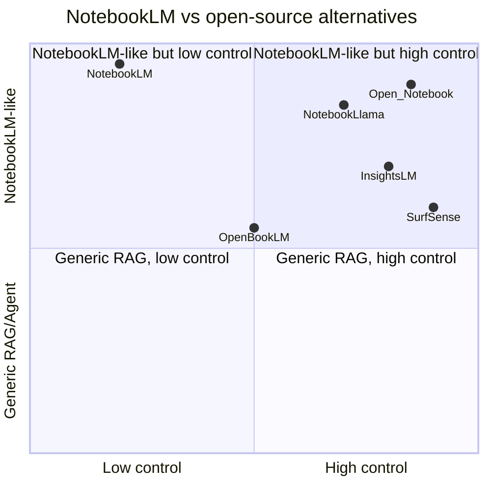
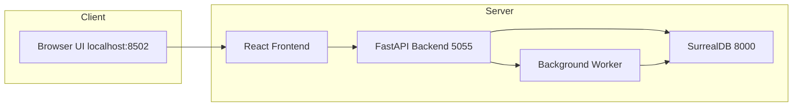
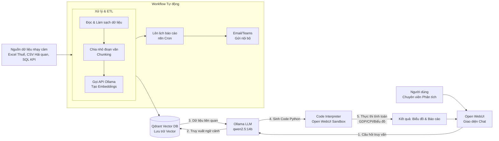
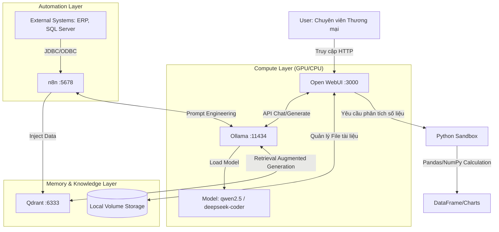
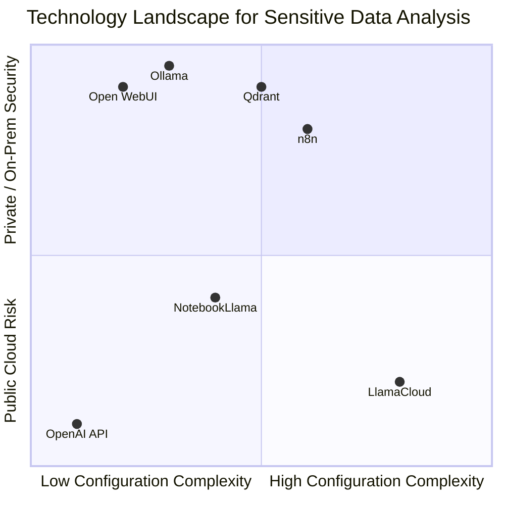
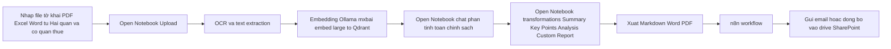
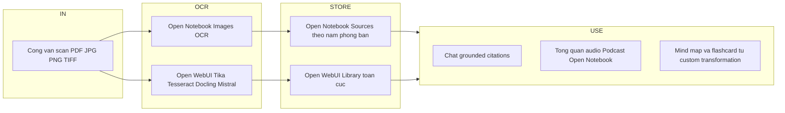
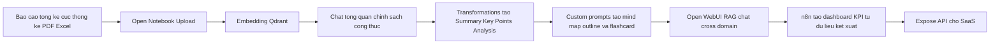
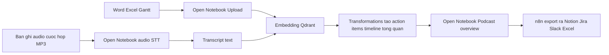
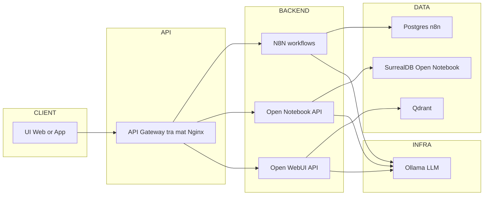

# Chương 1. Nghiên cứu phân tích về Notebook ứng dụng trong cộng đồng AI Private Local:

>>> Hãy phân tích các tính năng chức năng và tính phù hợp nhất với đối tượng nào khi dùng Notebooklm?
>>> hãy so sánh với các sản phẩm công nghệ open source full functionals và free licensed khác có trên github, và
>>> phân tích so sánh đầy đủ giữa Notebooklm với Open Notebook với cả mục tiêu của dev triển khai local docker trên windows và linux?

---

### Tóm tắt các khái niệm cơ bản:

**NotebookLM của Google:** cực kỳ mạnh về trải nghiệm người dùng, Audio Overview, tích hợp YouTube/audio, hỗ trợ 80+ ngôn ngữ, phù hợp học sinh, sinh viên, nghiên cứu viên, người dùng cá nhân không muốn setup kỹ thuật. Nhưng là dịch vụ cloud, dùng model của Google, dữ liệu được Google xử lý, không self-host được.support.google
Open Notebook (GitHub lfnovo/open-notebook): open source, MIT, được thiết kế rõ ràng là “privacy-focused alternative” cho NotebookLM, hỗ trợ nhiều model AI (OpenAI, Anthropic, Ollama, etc.), podcast 1–4 speaker, full-text + vector search, có Docker và chạy được trên Windows (WSL2) + Linux. Đây là ứng viên gần nhất nếu bạn muốn một “NotebookLM nhưng self-host/local”.

**Các giải pháp open source khác:** 

NotebookLlama (dùng LlamaCloud + OpenAI/ElevenLabs, cần Docker + Python, có podcast nhưng khá “hacky”), 

OpenBookLM (tập trung vào creating audio courses, Next.js + Cerebras, ít chú trọng privacy/local), 

InsightsLM (self-host, dùng Supabase + N8N, có podcast, nhưng nặng về no-code + cloud AI), 

SurfSense (RAG agent rất mạnh, tích hợp nhiều nguồn, support local LLM, có Docker, nhưng thiên về research agent enterprise hơn “notebook” đơn giản).

- Nếu mục tiêu của bạn là dev triển khai local bằng Docker trên Windows/Linux để có một NotebookLM-like hoàn toàn private, Open Notebook là lựa chọn “đúng tâm” nhất; NotebookLlama là lựa chọn kỹ thuật hơn nếu bạn chấp nhận phụ thuộc LlamaCloud; còn InsightsLM/SurfSense hợp nếu bạn muốn một kiến trúc RAG/agent lớn hơn.

Dưới đây là cái nhìn tổng quan theo dạng biểu đồ (trục X: mức tự chủ/điều khiển dữ liệu, trục Y: mức độ “giống NotebookLM về trải nghiệm notebook/chat/audio”):


### 1. NotebookLM của Google: tính năng & đối tượng phù hợp
### 1.1. Tính năng chức năng chính
_Theo tài liệu Google:_

**NotebookLM**:
“AI-powered research assistant designed to help you refine and organize your ideas” – trợ lý nghiên cứu giúp bạn tinh chỉnh và tổ hợp ý tưởng.support.google
Nguồn dữ liệu (sources) bạn có thể upload:

1.1.1. PDFs, websites, YouTube videos, audio files, Google Docs, Google Slides…support.google Có thể “discover new sources” luôn trong NotebookLM.support.google

1.1.2. Hỗ trợ đa ngôn ngữ & đa modal: Hỗ trợ 80+ ngôn ngữ.support.google

1.1.3. Tận dụng khả năng đa modal của Gemini 1.5 để xử lý text, hình ảnh, audio, v.v.

**Các khả năng chính:**

1.1.4. Chat với notebook: “Chat with your notebook to get grounded information based on your sources with clear in-line citations” – trả lời dựa trên nguồn, có trích dẫn inline để đảm bảo độ chính xác & minh bạch.support.google

1.1.5. Tạo artefact từ nguồn: Biến nguồn thành các format dễ tiếp cận: study guides, briefings, audio overviews, mind maps, slide decks, infographics, video overviews…support.google

1.1.6. Audio Overview: “Audio Overview” là đoạn hội thoại giữa 2 host AI tóm tắt sâu các chủ đề trong nguồn của bạn; có thể tạo bằng 1 click.blog +1
Có thể chia sẻ Audio Overview qua link công khai.

1.1.7. Video overview: Có tính năng “Video Overviews” (được liệt kê trong docs), nhưng bản thân docs chính thì bị cookie nên chỉ biết là có, không chi tiết được.

1.1.8. Hỗ trợ audio và YouTube mới: Google công bố việc hỗ trợ thêm audio file và YouTube URLs; có thể phân tích video/bài giảng với trích dẫn gắn với transcript của video; tạo study guide từ ghi âm lớp học, note, slide…

**Cách sử dụng/giới hạn:**

1.1.9. Trang plans cho thấy có 3 tier: Standard, NotebookLM Plus, NotebookLM Pro với:

1.1.10. Số nguồn tối đa mỗi notebook (50 cho bản tiêu chuẩn, 100 cho Plus/Pro).

1.1.11. Mức giới hạn số lần generate Audio/Video Overviews và các artefact khác (Pro cao hơn nhiều lần).notebooklm

**1.2. Đối tượng phù hợp**
Với bộ tính năng trên, NotebookLM phù hợp nhất với:

**1.2.1. Học sinh, sinh viên:**

- Lên study guide từ note + slide + video giảng đường.
  
- Học qua audio (Audio Overview), nghe tóm tắt trên đường đi.
  
- Nghiên cứu tài liệu nhiều nguồn (bài báo, slide, YouTube…).
  
**1.2.2. Nghiên cứu viên, academic:**

- Tổng hợp nhiều nguồn (PDF, web, video…), trích dẫn rõ ràng.
  
- Dùng notebook như “knowledge base” cho từng đề tài, với chat grounded.
  
**1.2.3. Người làm nội dung / marketer:**

- Dùng để brainstorm, phác thảo content, hoặc biến báo cáo thành slide deck/briefing.
  
**Người dùng cá nhân, không cần kỹ thuật:**

- Không muốn self-host; chấp nhận dữ liệu được xử lý bởi Google.
  
- Cần UX ổn định, tích hợp sẵn trong hệ sinh thái Google.
  
**1.3. Nhược điểm lớn:**

  - là SaaS public data,
    
  - không có self-host,
    
  - không có lựa chọn model khác,
    
  - không phù hợp nếu bạn bắt buộc phải giữ dữ liệu “chỉ chạy trong server nội bộ”.
    
  - Tuy có các cam kết Term Data Protection for Private Policy nhưng là hình thức cam kết Public sector (luật chung và của Google Service),
    
  - không đáp ứng các tùy biến về luật tuân thủ và an ninh an toàn của Quốc gia hoặc cá nhân/ tổ chức nhà nước riêng.
    
  - Các dữ liệu riêng của Tổ chức bạn đưa nên phải là dạng URL public, cập nhật lên google drive hoặc mạng share public thì NotebookLM mới có thể cập nhật.

### 2. Open Notebook: tính năng & đối tượng phù hợp

### 2.1. Tính năng
- Theo file introduction và README của dự án:

**Định vị:** “A powerful, open-source AI-powered research and note-taking platform… Designed as a privacy-focused alternative to Google’s Notebook LM… while maintaining complete control over your data.”  

**MIT license.**

**Privacy-first:** “Runs entirely on your infrastructure… your sensitive research data never leaves your control.”

**Multi-model AI:** Hỗ trợ 15+ provider: OpenAI, Anthropic, Google Gemini, Mistral, DeepSeek, Ollama (local), v.v.; cho phép đổi model để tối ưu cost/hiệu năng/chức năng.

**Podcast generation:** “Advanced Podcast Generation – 1–4 customizable speakers – a significant improvement over Google NotebookLM’s 2-speaker limitation.”

**Content integration:** Hỗ trợ nhiều loại nội dung:

2.1.1. Web links & articles

2.1.2. PDF, EPUB, Office docs

2.1.3. YouTube videos, audio files, Markdown, plain text, paste text…

**Intelligent search:** “Full-text and vector search across all your research materials, notes, and conversations.”

**Context control:** 3 mức context:

- No Context (AI không dùng tài liệu).
  
- Summary Only (chỉ gửi summary).
  
- Full Content (gửi toàn bộ text).
  
**Transformations & note:** Custom prompt để extract insight, tóm tắt, phân tích theme.

- Tạo note có hỗ trợ AI, tích hợp giữa note con người & AI-generated.

**Citations:** Trả lời có citations tham chiếu đến nguồn, giống NotebookLM.

### 2.2. Kiến trúc & cài đặt Theo installation guide:

**Yêu cầu hệ thống:**
2.2.1.1 CPU: 2+ core (4+ core recommended).

2.2.1.2. RAM: tối thiểu 4GB, khuyến nghị 8GB+.

2.2.1.3. Storage: ≥10GB.

2.2.1.4. OS: macOS 10.15+, Linux (Ubuntu 18.04+, Debian 9+, CentOS 7+, Fedora 30+), Windows 10+ (WSL2 recommended).

2.2.1.5. Cần Python 3.9+ nếu cài từ source, và Docker nếu dùng Docker.

**Các phương thức cài:**

- Docker Single-Container: cho người mới, easy setup, nhưng ít control hơn.
  
- Docker Multi-Container: cho production, scalable hơn.
  
- Source Installation: cho dev cần customize, cần Python và uv.
  
**Kiến trúc dịch vụ (4 service chính):**

- SurrealDB (port 8000): lưu notebook, sources, notes, metadata.
  
- FastAPI Backend (port 5055): REST API, docs, authentication, validation.
  
- Background Worker: xử lý job dài như podcast generation, content transformations, embeddings.
  
- React frontend (port 8502): UI cho notebooks, chat, sources, notes, search.
  
**Quick start (Docker):**

- Docker compose + .env file, chạy docker compose up -d, truy cập http://localhost:8502.

### 2.3. Đối tượng phù hợp:

2.3.1. Người coi trọng privacy: - Muốn toàn quyền dữ liệu, không gửi tài liệu nhạy cảm ra cloud.

2.3.2. Dev / sysadmin muốn có nền tảng self-host: 

- Có Docker trên Linux hoặc Windows (WSL2).
  
- Muốn tích hợp với Ollama, hoặc model khác, để chạy local hoặc hybrid.
  
2.3.3. Team nghiên cứu / small business: 

- Cần một “knowledge base + AI assistant” nội bộ.
  
- Cần API để build thêm tích hợp (Open Notebook có full REST API).
  
- Open Notebook là “closest” về cả UX lẫn tư duy notebook/sources/citations nếu bạn muốn một NotebookLM nhưng tự host.

### 3. Các sản phẩm open source “full functional & free licensed” khác trên GitHub

- được định vị là “NotebookLM alternative” hoặc tương đương:

### 3.1. NotebookLlama (run-llama/notebookllama)

**Định vị:** “A fully open-source alternative to NotebookLM, backed by LlamaCloud.”

- MIT license.
  
**Tech stack & cách chạy:** Python, dùng uv quản lý dependency.

- **Cần API Key làm RAG:**
  
- OPENAI_API_KEY
  
- ELEVENLABS_API_KEY
  
- LLAMACLOUD_API_KEY

**Dùng LlamaCloud cho:**

- Document extraction.
  
- Index pipeline ( embeddings) – có thể dùng OpenAI embedding hoặc custom.
  
**- Backend:** Chạy Postgres và Jaeger bằng docker compose up -d.
  
**- MCP Server:** Chạy MCP server (src/notebookllama/server.py) và app Streamlit (streamlit run src/notebookllama/Home.py), truy cập http://localhost:8501/.
  
**Tính năng:**

- UX kiểu NotebookLM (notebook, sources, chat grounded).
  
- Hỗ trợ audio/podcast (dùng ElevenLabs).
  
- Mạnh về LlamaIndex ecosystem, pipeline RAG tùy biến.

**Nhược điểm:**

- Phụ thuộc LlamaCloud (service của LlamaIndex) + OpenAI/ElevenLabs, không hướng tới “100% local”.
  
- Cài đặt nhiều bước hơn so với Open Notebook (script tạo agent, pipeline, v.v.).

### 3.2. OpenBookLM (open-biz/OpenBookLM)

**3.2.1. Định vị:** “OpenBookLM: Revolutionizing Content Comprehension… Open Source alternative to NoteBookLM from Google.”

**3.2.2. Tập trung:** Nền tảng tạo “audio-based courses” và podcasts giáo dục, nhiều ngôn ngữ (dùng Suno bark cho TTS).

**3.2.3. Target audience:** Học sinh, sinh viên, researcher, lifelong learner, community learning.

**3.2.4. Tech stack:**

**- Frontend:** Next.js, React, TypeScript, Tailwind, Prisma ORM.

**- Database:** PostgreSQL.

**- Backend:** Next.js API routes, LLM service (Cerebras API), Redis cache.

**3.2.5. Cách chạy:** 

- Cần Node.js 20+, pnpm, Python 3.8+.

- Cài bằng pnpm install, chạy dev server bằng pnpm dev.

- Không nhấn mạnh Docker, thiên về dev web hơn.

### 3.3. InsightsLM (theaiautomators/insights-lm-public)

**3.3.1. Định vị:** “The Open Source NotebookLM Alternative… open-source, self-hostable alternative to NotebookLM… grounded responses exclusively in the sources you provide…”

**3.3.2. Key features:** 

- Chat with documents, có citations.

- Podcast generation giống NotebookLM.

- Private and self-hosted; có thể dùng local models nếu muốn.

**3.3.3. Stack:**

**- Frontend:** React + Vite + TypeScript + shadcn-ui + Tailwind.

**- Backend:** Supabase (DB, auth, storage) + N8N (workflow automation).

**Triển khai:**
  
- Nhiều guide hướng dẫn cho “no-coders” dùng Supabase + N8N, ít thiên về Docker local thuần.
  
- Có repo “Fully Local InsightsLM” riêng cho Ollama + Whisper + CoquiTTS, nếu bạn muốn toàn bộ local.

### 3.4. SurfSense (MODSetter/SurfSense)

**3.4.1. Định vị:** “While tools like NotebookLM and Perplexity are impressive… SurfSense elevates this capability by integrating with your personal knowledge base.”
“Have your own highly customizable private NotebookLM and Perplexity integrated with external sources.”

**3.4.2. Features:**

3.4.2.1. Multiple file format support (50+ extensions), lưu vào “personal knowledge base”.

3.4.2.2. Powerful search trong nội dung đã lưu.

3.4.2.3. Chat với saved content, được cited answers.

3.4.2.4. Privacy & Local LLM: support Ollama local LLMs.

3.4.2.5. Self-hostable, open source, có docker-compose (quickstart).

3.4.2.6. Team collaboration với RBAC (Owner, Admin, Editor, Viewer).

3.4.2.7. Podcast generation (có local TTS như Kokoro TTS + nhiều provider khác).

3.4.2.8. Advanced RAG: 100+ LLMs, 6000+ embedding models, hierarchical indices, hybrid search (semantic + full-text).

3.4.2.9. Kết nối nhiều nguồn external: Tavily, LinkUp, Slack, Linear, Jira, Confluence, Notion, Gmail, YouTube, GitHub, v.v.

3.4.2.10. License: Apache-2.0.

**3.5. Các stack lớn khác (như “Complete self-hosted AI stack”)** Có nhiều repo (ví dụ: ai-launchkit-local) được mô tả là:
“Complete self-hosted AI stack with 40+ services: 

- Transform YouTube videos & PDFs into AI podcasts (Open Notebook),
  
- local LLMs (Ollama CPU/GPU),
  
- workflow automation (n8n),
  
- AI agents (Flowise),
  
- vector databases (Qdrant),
  
- German TTS voice, and business tools. One-command Docker deployment.”
  
Nghĩa là thay vì chỉ dùng riêng lẻ Open Notebook, bạn có thể dùng cả stack bao gồm Open Notebook + Ollama + n8n + Flowise + Qdrant… để xây một môi trường AI nội bộ rất lớn.

### 4. So sánh đầy đủ NotebookLM vs Open Notebook (đặc biệt cho dev triển khai Docker trên Windows/Linux)

#### 4.1. Bảng so sánh nhanh

| Tiêu chí                    | NotebookLM (Google)                                      | Open Notebook                                                      |
|---------------------------|----------------------------------------------------------|-------------------------------------------------------------------|
| Deployment                 | Cloud SaaS, truy cập qua web/mobile                      | Self-host, Docker hoặc from source (Linux, macOS, Windows WSL2)   |
| Privacy / dữ liệu          | Dữ liệu do Google xử lý, chịu chính sách privacy của GG   | Chạy trên infra của bạn; bạn kiểm soát dữ liệu                   |
| Model AI                   | Chỉ dùng Gemini của Google                                | 15+ providers (OpenAI, Anthropic, Gemini, Mistral, Ollama…)     |
| License / mã nguồn         | Đóng source, sản phẩm của Google                         | MIT, full open-source                                             |
| Podcast / audio           | Audio Overview (2 host AI), Video Overviews               | Podcast 1–4 speakers, nâng cao so với NotebookLM   |
| Nguồn (sources)           | PDF, web, YouTube, audio, Google Docs/Slides… | Web, PDF/EPUB/Office, YouTube, audio, Markdown, paste text… |
| Chat grounded + citations  | Có, inline citations                                      | Có, citations & references                        |
| Search                     | Basic search                                              | Full-text + vector search                         |
| Context control            | Hạn chế                                                   | 3 mức: No Context / Summary Only / Full Content    |
| Offline capability         | Không                                                     | Có thể chạy offline với local models (Ollama)      |
| API                        | Giới hạn, chủ yếu qua Google ecosystem                    | Full REST API với docs (/api/notebooks, /api/sources, etc.) |
| Multi-user / collaboration | Có (qua Google Account, chia sẻ notebook, public link)    | Có thể chạy cho nhiều user (qua infra của bạn), nhưng không phải SaaS |
| Độ khó triển khai          | 0 – chỉ cần tài khoản Google                             | Trung bình – cần Docker/Python và cấu hình .env                   |
| Phù hợp đối tượng         | Người dùng cá nhân, không muốn tự quản hạ tầng             | Dev, team privacy-first, muốn custom & mở rộng                    |

---

### 4.2. So sánh chi tiết theo góc độ dev triển khai Docker trên Windows/Linux:

**a) Mục tiêu deployment**

**4.2.1. NotebookLM:**

- Không có tùy chọn self-host/local;
  
- bạn chỉ có thể:

4.2.1.1. Dùng web UI tại notebooklm.google.

4.2.1.2. Dùng mobile app.

4.2.1.3. Không thể “deploy Docker trên Windows/Linux” 

4.2.1.4. không có Docker image, 

4.2.1.5. không có API mở để tích hợp nội bộ (ngoài integration với Google ecosystem).

**4.2.2. Open Notebook:** Được thiết kế để chạy trên máy bạn hoặc server nội bộ:

- Hỗ trợ Docker single/multi-container, kèm docker-compose.yml, .env.example.
  
- Hỗ trợ Linux/macOS và Windows (với WSL2).
  
- Có REST API và docs tại http://localhost:5055/docs.
  
**b) Triển khai trên Linux** Ví dụ trên Linux (Ubuntu 20.04):

- Bước 1 – Cài Docker + Docker Compose: Cài theo hướng dẫn chính thức của Docker.
  
- Bước 2 – Chuẩn bị Open Notebook

```bash
mkdir open-notebook && cd open-notebook
curl -O https://raw.githubusercontent.com/lfnovo/open-notebook/main/docker-compose.yml
curl -O https://raw.githubusercontent.com/lfnovo/open-notebook/main/.env.example
mv .env.example docker.env
```
_(Theo quickstart trong docs)._

- Bước 3 – Cấu hình môi trường:

Edit docker.env:  Đặt OPENAI_API_KEY, ANTHROPIC_API_KEY, hoặc cấu hình Ollama URL nếu muốn local. 

Cấu hình SURREAL_URL, password, ports nếu cần.

- Bước 4 – Chạy:

```bash
docker compose up -d
```

Theo docs, sau đó truy cập: 

```https
UI: http://localhost:8502
API: http://localhost:5055
API docs: http://localhost:5055/docs
```

- Bước 5 – Dùng Ollama cho local models (nếu muốn):
  
- Cài Ollama riêng trên host.
  
- Trong docker.env, set base URL của Ollama (ví dụ http://host.docker.internal:11434) và chọn model.

**Ưu điểm trên Linux:**

- Docker performance tốt nhất.
  
- Dễ dàng tích hợp với các service khác (n8n, Flowise, Qdrant…) như trong “Complete self-hosted AI stack” đã nhắc tới.github

**c) Triển khai trên Windows**

Trên Windows, có 2 hướng chính:

- Dùng WSL2 (được khuyến nghị bởi docs):
Bước 1 – Bật WSL2 + cài Docker Desktop for Windows:
Đảm bảo Docker Desktop chạy với WSL2 backend.
Bước 2 – Trong WSL2 (Ubuntu):
Làm y hệt như trên Linux:

```WSL2 
mkdir open-notebook && cd open-notebook
curl -O https://raw.githubusercontent.com/lfnovo/open-notebook/main/docker-compose.yml
curl -O https://raw.githubusercontent.com/lfnovo/open-notebook/main/.env.example
mv .env.example docker.env
# edit docker.env
docker compose up -d
```
- Truy cập từ Windows browser: http://localhost:8502.

- Bước 3 – Ollama (nếu muốn):

- Bạn có thể cài Ollama trên WSL2 hoặc trên Windows và gọi từ WSL2 qua host.docker.internal.

- Chạy Docker trực tiếp trên Windows (không WSL2):

- Về lý thuyết vẫn có thể, nhưng docs ghi rõ “Windows 10 or later (WSL2 recommended)”, nên nếu bạn dùng Windows containers:

- Có thể cần chỉnh lại đường dẫn volume (do mapping ổ đĩa Windows khác).
  
- Một vấn đề thường gặp là performance của Docker trên Windows kém hơn Linux/WSL2.

**d) Kiến trúc deployment (trên cả Windows & Linux)**

Kiến trúc cơ bản (theo docs) có thể tóm tắt:



- Nếu bạn dùng Ollama local:

  - BE hoặc BWK gọi Ollama API (port 11434) trên host hoặc trong container khác.
    
- Nếu bạn dùng external AI (OpenAI, Anthropic…):
  
  - Gọi API qua internet, nên cần kết nối mạng.
    
**e) So sánh mục tiêu dev giữa NotebookLM và Open Notebook**

**NotebookLM:**

- **Mục tiêu:** “AI research tool & thinking partner” do Google vận hành, tối ưu trải nghiệm người dùng cuối, không phải là nền tảng dev.

- **Dev không thể:**
  
  - Thay đổi model
    
  - Tự deploy trong private cloud.
  
  - Tích hợp sâu vào hệ thống nội bộ (ngoài việc export/từ tài liệu).

**Open Notebook:**

**Mục tiêu:**

  - private,
    
  - self-hosted notebook AI,
    
  - với API,
    
  - modular,
    
  - nhiều AI providers, phù hợp làm: “Private knowledge base” cho team.
    
**Backend service cho app nội bộ (qua REST API).**

- **Dev** có thể:
  
  - Tích hợp Ollama hoặc nhiều LLM khác.
    
  - Tùy biến prompt, transformations.
    
  - Làm fork/modify vì MIT.
    
  - Nhúng vào pipeline lớn hơn ( cùng với n8n, Flowise, RAGFlow, v.v.).

### 5. So sánh NotebookLM với các open-source alternatives khác:
   
#### 5.1. Bảng tổng quan (so với NotebookLM)

| Sản phẩm       | Open-source & license | Deployment                 | Local LLM support  | Podcast / audio         | Điểm mạnh chính so với NotebookLM                                    | Hạn chế chính so với NotebookLM                 |
|---------------|----------------------|----------------------------|--------------------|-------------------------|---------------------------------------------------------------------|-----------------------------------------------|
| NotebookLM    | Không                | Cloud SaaS                 | Không              | Audio/Video Overview    | UX mượt, tích hợp Google ecosystem, Audio Overview rất polished     | Không self-host, không swap model             |
| Open Notebook | MIT                  | Docker/source, Win/Linux/Mac| Có (Ollama, etc.)  | 1–4 speakers podcast     | Giống NotebookLM + privacy + multi-model + full API                | Cần kỹ thuật để deploy/maintain               |
| NotebookLlama | MIT                  | Docker + Python (local)     | Có (nếu bạn config)| Có (ElevenLabs)         | Rất mạnh về RAG pipeline với LlamaCloud/LlamaIndex                 | Phụ thuộc LlamaCloud & OpenAI/ElevenLabs      |
| OpenBookLM    | MIT                  | Dev server (Node.js/Next)  | Không nhấn mạnh    | Audio courses (Suno bark)| Tập trung vào audio courses, multilingual, community learning       | Không thiên về self-host/local-first          |
| InsightsLM    | MIT                  | Supabase + N8N (cloud/local) | Có (repo riêng)   | Có                      | Tích hợp sẵn workflow automation (N8N), phù hợp no-code / low-code   | Stack hơi nặng, thiên về demo/no-code         |
| SurfSense     | Apache-2.0           | Docker, self-hosted        | Có (Ollama)       | Có, nhanh + local TTS    | RAG agent rất mạnh, tích hợp nhiều nguồn external, RBAC             | Hướng enterprise, UX không “notebook” đơn giản |

#### 5.2. So sánh một vài điểm đáng chú ý

- Open Notebook vs NotebookLM:

  - Open Notebook bù đắp yếu tố “data control & model freedom” – đây là trade-off rõ ràng: bạn đánh đổi UX “đã được polish bởi Google” lấy quyền kiểm soát.
    
  - Podcast 1–4 speakers là nâng cấp thú vị so với 2 host AI của NotebookLM.

- NotebookLlama vs NotebookLM:
  
  - NotebookLlama gần như là “NotebookLM được rebuild bằng LlamaIndex + LlamaCloud”:
    
    - Nếu bạn đã quen LlamaIndex và muốn RAG pipeline tùy biến, NotebookLlama hợp.
      
    - Nhưng nếu bạn muốn “đóng gói 1 click lên Docker để chạy local” mà không quan tâm nhiều đến index pipeline, Open Notebook dễ dùng hơn.

- OpenBookLM vs NotebookLM:

  - Nó ít giống “NotebookLM cho tổng quát” mà giống “NotebookLM cho giáo dục & audio courses”.

  - Nếu mục tiêu là tạo khoá học audio đa ngôn ngữ, OpenBookLM rất phù hợp; còn nếu muốn “private notebook research” như NotebookLM, Open Notebook/NotebookLlama gần hơn.

- InsightsLM vs NotebookLM:

  - InsightsLM nhấn mạnh “RAG cho knowledge base công ty” + workflow automation (N8N).

  - Nếu bạn là doanh nghiệp muốn nhanh chóng có “internal AI assistant” nhưng không có dev chuyên深度 về LLM, InsightsLM + Supabase + N8N là lộ trình hợp lý.

- SurfSense vs NotebookLM:

  - SurfSense gần với “NotebookLM + Perplexity + RAG framework mạnh + nhiều integrations”, đặc biệt là external sources và RBAC.

  - Nếu bạn cần:

    - Kết nối Jira, Confluence, Notion, Gmail, GitHub…

    - Local LLM + Podcast + hybrid search hierarchical RAG, thì SurfSense là lựa chọn enterprise hơn; nhưng setup và vận hành sẽ phức tạp hơn Open Notebook.

## 6. Gợi ý lựa chọn cho dev triển khai local Docker trên Windows/Linux

### 6.1. Nếu bạn muốn một NotebookLM “tương đương chức năng” nhưng self-host/local

#### Ưu tiên:

- Open Notebook là lựa chọn đầu tiên nên thử:

  - Giống NotebookLM về tư duy (notebook – sources – chat – citations – audio).
    
  - MIT license.
    
  - Hỗ trợ Docker multi-container, production-ready.
    
  - Full REST API để bạn xây thêm các service bên trên.
    
  - Nếu bạn sẵn sàng trade-off một chút UX để lấy sức mạnh RAG pipeline:

**NotebookLlama:**

-  Dùng LlamaCloud để parse, index tài liệu.

-  Rất mạnh nếu bạn muốn:
  
  - Tự cấu trúc index, pipeline, embedding models khác nhau.
    
  - Tận dụng ecosystem LlamaIndex.
    
### 6.2. Nếu bạn muốn stack lớn hơn, “full AI lab” local

Có thể cân nhắc các repo kiểu “Complete self-hosted AI stack” (như ai-launchkit-local hoặc tương tự), trong đó:

- Open Notebook dùng để tạo podcast từ YouTube/PDF.
  
- Ollama cho local LLMs.
  
- n8n cho workflow.

- Flowise cho AI agent.

- Qdrant hoặc vector DB khác cho RAG.github

Với cách này, bạn không chỉ có NotebookLM-alternative mà còn có một nền tảng automation khá lớn.

### 6.3. Nếu bạn thiên về enterprise/knowledge base nội bộ

**SurfSense:**

- Nếu bạn cần: 

  - Kết nối nhiều nguồn SaaS (Jira, Confluence, Notion, Gmail, GitHub…).

  - Local LLM + podcast + hybrid search.

  - RBAC cho team.

**InsightsLM:**

- Nếu bạn thích combination Supabase + N8N và muốn một giải pháp no-code/low-code để cấu hình workflow và RAG.

## 7. Kết luận ngắn gọn:

**NotebookLM:** rất mạnh về trải nghiệm người dùng cuối, hỗ trợ nhiều nguồn, audio/video overview, đa ngôn ngữ, nhưng không dành cho ai cần self-host hoặc custom sâu.

**Open Notebook:** là “open-source, privacy-focused alternative” gần nhất với NotebookLM về tư duy và workflow, có hỗ trợ đầy đủ cho Docker trên Windows/Linux, multi-model, podcast nhiều speakers, và full API – đây là lựa chọn hợp lý nhất nếu bạn muốn một NotebookLM chạy local.

**Các alternative khác (NotebookLlama, OpenBookLM, InsightsLM, SurfSense…)** mỗi cái có một thế mạnh riêng (RAG pipeline, audio courses, automation, enterprise integrations); bạn có thể chọn phụ thuộc vào:

- Mức độ bạn cần “giống NotebookLM”.
  
- Mức độ bạn cần privacy & local.
  
- Mức độ bạn sẵn sàng vận hành hệ thống phức tạp hơn.

- Nếu bạn nói rõ hơn use case (VD: nghiên cứu academic, nội bộ công ty, hay làm sản phẩm SaaS), mình có thể gợi ý một stack cụ thể (combo Open Notebook + Ollama + n8n/Flowise + Qdrant, hoặc NotebookLlama + LlamaCloud, v.v.) kèm ví dụ cấu hình Docker và workflow cụ thể.

---

# Chương 2. Phân tích Kịch bản UseCases:

>>> Tôi cần dùng use case chuyên về nghiên cứu phân tích dữ liệu xử lý dữ liệu nhậy cảm trong chuyên ngành: thủ tục kê khai thuế và doanh thu từ thuế, , xuất nhập khẩu thủy hải sản từ Hải quan, tình hình thống kê dữ liệu dân số - GDP - CPI - và các chỉ số KPI cho Ngoại thương, nội bộ dự án tiến độ của công ty, hay làm sản phẩm SaaS, yêu cầu tổ chức văn bản xử lý công văn quyết định, thư viện số nhân dạng văn bản OCR sang Báo cáo phân tích, tổng quan giải thích khái niệm, mind set: Sơ đồ tư duy/mind map, thẻ ghi nhớ, bài kiểm tra, tổng quan bằng video, tổng quan bằng âm thanh, tài liệu tóm tắt cuộc họp và nhiều tính năng của Văn phòng ủy ban xã phường), hãy gợi ý một Full stack cụ thể (ví dụ: combo Open Notebook + Ollama + LM Studio MCP Server + Open-WebUI + n8n/Flowise + Qdrant, hoặc NotebookLlama + LlamaCloud, v.v.) kèm ví dụ cấu hình Docker và workflow quy trình vẽ theo mermaid Graph TG, quadrantChart, flowchart LR cụ thể.

---

Đối với yêu cầu xử lý dữ liệu **nhạy cảm** (Thuế, Hải quan, KPI nội bộ, GDP) và yêu cầu bảo mật cao (Private Deployment/Local-First), việc sử dụng các dịch vụ đám mây công khai (OpenAI, LlamaCloud) là tối kỵ.

Dưới đây là giải pháp **Full Stack Local AI** tối ưu hóa cho khả năng phân tích dữ liệu, bảo mật và tự động hóa quy trình.

### 1. Đề xuất Combo: "The Private Data Analyst Stack"

Tôi đề xuất bộ combo sau đây để thay thế các giải pháp Cloud, đảm bảo dữ liệu không bao giờ rời khỏi server nội bộ:

*   **LLM Inference Engine:** **Ollama** (Hỗ trợ đa mô hình, dễ thay đổi model).
    *   *Models đề xuất:* `qwen2.5:14b` (Rất giỏi Toán/Code/Logic và hiểu Tiếng Việt tốt hơn Llama), hoặc `deepseek-coder-v2` (Chuyên phân tích dữ liệu, viết SQL/Python).
*   **Orchestration & Automation:** **n8n** (Tự hosted). Dùng để kéo dữ liệu từ Excel/SQL, chuẩn hóa và đẩy vào RAG hoặc báo cáo.
*   **RAG & Knowledge Base:** **Qdrant Vector Database** (Hiệu năng cao, dễ Docker).
*   **Frontend / Notebook Interface:** **Open WebUI** (Giao diện giống ChatGPT, có hỗ trợ "Code Interpreter" để chạy Python phân tích GDP/CPI ngay trên browser, và hỗ trợ Web Search nếu cần).
*   **Business Logic (Optional):** **LangChain** (Tích hợp trong n8n hoặc code Python tùy chỉnh).

---

### 2. Cấu hình Docker Compose (docker-compose.yml)

Đây là file cấu hình để khởi động toàn bộ hệ thống chỉ với một lệnh `docker-compose up -d`.

```yaml
version: '3.8'

services:
  # 1. Vector Database: Lưu trữ ngữ cảnh từ luật thuế, báo cáo hải quan
  qdrant:
    image: qdrant/qdrant:latest
    container_name: qdrant_db
    ports:
      - "6333:6333"
    volumes:
      - ./data/qdrant:/qdrant/storage
    restart: always

  # 2. LLM Engine: Chạy model AI nội bộ
  ollama:
    image: ollama/ollama:latest
    container_name: ollama_ai
    ports:
      - "11434:11434"
    volumes:
      - ./data/ollama:/root/.ollama
    restart: always
    # GPU support (nếu có card NVIDIA):
    # deploy:
    #   resources:
    #     reservations:
    #       devices:
    #         - driver: nvidia
    #           count: 1
    #           capabilities: [gpu]

  # 3. Frontend & Code Interpreter: Giao diện làm việc chính
  open-webui:
    image: ghcr.io/open-webui/open-webui:main
    container_name: open_webui
    ports:
      - "3000:8080"
    environment:
      - 'OLLAMA_BASE_URL=http://ollama:11434'
      - 'RAG_EMBEDDING_ENGINE=ollama'
      - 'RAG_EMBEDDING_MODEL=nomic-embed-text' # Model nhúng vector nhỏ gọn
      - 'ENABLE_RAG_WEB_SEARCH=true'
      - 'DEFAULT_MODELS=qwen2.5:14b,deepseek-coder-v2:16b'
    volumes:
      - ./data/open-webui:/app/backend/data
    depends_on:
      - ollama
      - qdrant
    restart: always

  # 4. Automation: Kết nối API, xử lý Excel, lịch trình báo cáo
  n8n:
    image: n8nio/n8n
    container_name: n8n_automation
    ports:
      - "5678:5678"
    environment:
      - 'N8N_BASIC_AUTH_ACTIVE=true'
      - 'N8N_BASIC_AUTH_USER=admin'
      - 'N8N_BASIC_AUTH_PASSWORD=secure_password_change_me'
      - 'WEBHOOK_URL=http://localhost:5678/'
      - 'EXECUTIONS_MODE=queue'
    volumes:
      - ./data/n8n:/home/node/.n8n
    depends_on:
      - ollama
      - qdrant
    restart: always

  # Dịch vụ bổ trợ: Cài đặt model tự động khi container khởi động
  ollama-puller:
    image: ollama/ollama:latest
    container_name: ollama_puller
    depends_on:
      - ollama
    entrypoint: ["sh", "-c", "sleep 10 && ollama pull qwen2.5:14b && ollama pull nomic-embed-text"]
    networks:
      - default
```

---

### 3. Quy trình xử lý dữ liệu (Mermaid Diagrams)

Dưới đây là các biểu diễn thị giác quy trình xử lý dữ liệu nhạy cảm theo yêu cầu của bạn.

#### A. Flowchart LR (Luồng dữ liệu tổng quan)
Biểu diễn sự di chuyển của dữ liệu từ thô đến thông tin tình báo (Business Intelligence).



#### B. Graph TD (Chi tiết kiến trúc kỹ thuật)
Phân tích sâu hơn về cách các thành phần giao tiếp trong hệ thống Local-First.



#### C. QuadrantChart (Đánh giá công nghệ)
Biểu đồ định vị các công nghệ dựa trên độ phức tạp cấu hình và mức độ bảo mật (Privacy).



---

### 4. Workflow Chi tiết cho từng Use Case cụ thể

Với stack trên, bạn có thể triển khai các quy trình cụ thể như sau:

#### 1. Use Case: Phân tích Thủ tục Kê khai Thuế & Doanh thu
*   **Input:** File PDF hướng dẫn thuế mới + File Excel doanh thu nội bộ.
*   **Quy trình:**
    1.  Upload PDF lên Open WebUI -> Tự động nhúng vào Qdrant.
    2.  Upload Excel doanh thu.
    3.  **Prompt:** "Dựa trên luật thuế trong tài liệu đã tải và file Excel doanh thu này, hãy viết code Python để tính thuế phải nộp và kiểm tra các khoản any chi có bất thường không?"
    4.  **Hệ thống:** Ollama (DeepSeek-Coder) viết code Python -> Open WebUI chạy code -> Trả về kết quả phân tích rủi ro.

#### 2. Use Case: Thống kê Dân số - GDP - CPI & KPI Ngoại thương
*   **Input:** Các file CSV số liệu thống kê tổng hợp.
*   **Quy trình:**
    1.  Sử dụng **n8n** để định kỳ tải file CSV từ folder mạng vào hệ thống.
    2.  n8n gửi lệnh đến **Ollama** để tóm tắt các chỉ số (CPI tăng/giảm, xu hướng nhập khẩu thủy hải sản).
    3.  n8n sử dụng function calling để yêu cầu vẽ biểu đồ (Plotly/Matplotlib).
    4.  Kết quả gửi tự động vào kênh thông tin nội bộ (Teams/Slack) của bộ phận chiến lược.

#### 3. Use Case: SaaS & Quản lý tiến độ dự án nội bộ
*   **Input:** Dữ liệu task từ Jira/Asana hoặc Excel.
*   **Quy trình:**
    *   Tạo một chatbot nội bộ trên Open WebUI kết nối với Vector DB chứa các tài liệu quy trình dự án.
    *   Nhân viên hỏi: "Dự án xuất khẩu tôm hiện tại đang chậm ở giai đoạn nào và nguyên nhân chính là gì theo báo cáo tuần này?"
    *   Bot truy xuất dữ liệu进度 (progress) từ database và so sánh với KPI trong vector DB để trả lời.

### 4. Tại sao chọn Stack này thay vì LM Studio + MCP?

*   **Ollama vs LM Studio MCP:** Ollama hoạt động tốt hơn như một backend server (headless) trong môi trường Docker production, trong khi LM Studio thiên về desktop app. Ollama dễ tích hợp với n8n hơn qua API.
*   **Open WebUI vs NotebookLlama:** Open WebUI hiện tại đã tích hợp sẵn tính năng **Artifact** và **Code Interpreter** (tương tự ChatGPT Advanced Data Analysis), cho phép bạn vừa chat, vừa xem code, vừa thấy biểu đồ ngay trên giao diện web, rất phù hợp cho việc làm sản phẩm SaaS hoặc phân tích nhanh.
*   **Qdrant vs LlamaCloud:** LlamaCloud là dịch vụ trả phí trên cloud. Qdrant là Open Source, bạn tự host, đảm bảo 100% dữ liệu thuế/hải quan không bị rò rỉ ra bên ngoài.

Cấu trúc này đảm bảo bạn có một hệ thống **"Do-it-yourself"** mạnh mẽ, an toàn tuyệt đối cho dữ liệu tài chính - kinh tế.

#### 4.1. Ví dụ cấu hình Docker full stack

- Mình sẽ đề xuất 2 cách:

1. Một file docker-compose tổng hợp: n8n starter kit + Open Notebook + Open WebUI + Ollama + Qdrant (tất cả cùng một stack).
   
2. Hoặc giữ n8n starter kit riêng, và chạy Open Notebook + Open WebUI trong 2 compose nhỏ gọn (đơn giản hơn trong thực tế).
   
4.1. File .env chung (ví dụ: .env)
```env
# Postgres (cho n8n)
POSTGRES_USER=n8n_user
POSTGRES_PASSWORD=change_me_strong_password
POSTGRES_DB=n8n_db

# n8n
N8N_ENCRYPTION_KEY=change_me_random_encryption_key
N8N_USER_MANAGEMENT_JWT_SECRET=change_me_jwt_secret
OLLAMA_HOST=ollama:11434

# Open Notebook
OPENAI_API_KEY=sk-...  # nếu bạn muốn dùng thêm cloud model, nếu không thì bỏ qua
SURREAL_URL=ws://open-notebook-surreal:8000/rpc
SURREAL_USER=root
SURREAL_PASSWORD=root
SURREAL_NAMESPACE=open_notebook
SURREAL_DATABASE=production

# Open Notebook -> Ollama
OLLAMA_API_BASE=http://ollama:11434

# Open WebUI
WEBUI_SECRET_KEY=change_me_webui_secret
```

#### 4.2. docker-compose-full.yml (tổng hợp)
Lưu ý: đây là config tham khảo, bạn có thể tách ra nếu không muốn mọi thứ chạy trong 1 file.

```yaml
version: "3.8"

services:
  # ===== Postgres =====
  postgres:
    image: postgres:16-alpine
    hostname: postgres
    networks: [ai-net]
    restart: unless-stopped
    environment:
      - POSTGRES_USER=${POSTGRES_USER}
      - POSTGRES_PASSWORD=${POSTGRES_PASSWORD}
      - POSTGRES_DB=${POSTGRES_DB}
    volumes:
      - postgres_storage:/var/lib/postgresql/data
    healthcheck:
      test: ["CMD-SHELL", "pg_isready -h localhost -U ${POSTGRES_USER} -d ${POSTGRES_DB}"]
      interval: 5s
      timeout: 5s
      retries: 10

  # ===== n8n =====
  n8n:
    image: n8nio/n8n:latest
    hostname: n8n
    container_name: n8n
    networks: [ai-net]
    restart: unless-stopped
    ports:
      - "5678:5678"
    environment:
      - DB_TYPE=postgresdb
      - DB_POSTGRESDB_HOST=postgres
      - DB_POSTGRESDB_USER=${POSTGRES_USER}
      - DB_POSTGRESDB_PASSWORD=${POSTGRES_PASSWORD}
      - DB_POSTGRESDB_DATABASE=${POSTGRES_DB}
      - N8N_DIAGNOSTICS_ENABLED=false
      - N8N_PERSONALIZATION_ENABLED=false
      - N8N_ENCRYPTION_KEY=${N8N_ENCRYPTION_KEY}
      - N8N_USER_MANAGEMENT_JWT_SECRET=${N8N_USER_MANAGEMENT_JWT_SECRET}
      - OLLAMA_HOST=${OLLAMA_HOST}
    env_file:
      - .env
    volumes:
      - n8n_storage:/home/node/.n8n
      - ./shared:/data/shared
    depends_on:
      postgres:
        condition: service_healthy

  # ===== Qdrant =====
  qdrant:
    image: qdrant/qdrant:latest
    hostname: qdrant
    container_name: qdrant
    networks: [ai-net]
    restart: unless-stopped
    ports:
      - "6333:6333"
    volumes:
      - qdrant_storage:/qdrant/storage

  # ===== Ollama =====
  ollama:
    image: ollama/ollama:latest
    container_name: ollama
    networks: [ai-net]
    restart: unless-stopped
    ports:
      - "11434:11434"
    volumes:
      - ollama_storage:/root/.ollama
    # (Tùy chọn) nếu có GPU NVIDIA:
    # deploy:
    #   resources:
    #     reservations:
    #       devices:
    #         - driver: nvidia
    #           count: 1
    #           capabilities: [gpu]

  # ===== Open Notebook (single image) =====
  open-notebook:
    image: lfnovo/open_notebook:v1-latest-single
    container_name: open-notebook
    networks: [ai-net]
    restart: unless-stopped
    ports:
      - "8502:8502"
      - "5055:5055"
    environment:
      - OLLAMA_API_BASE=${OLLAMA_API_BASE}
      - SURREAL_URL=${SURREAL_URL}
      - SURREAL_USER=${SURREAL_USER}
      - SURREAL_PASSWORD=${SURREAL_PASSWORD}
      - SURREAL_NAMESPACE=${SURREAL_NAMESPACE}
      - SURREAL_DATABASE=${SURREAL_DATABASE}
      # Nếu dùng thêm OpenAI / Anthropic:
      # - OPENAI_API_KEY=${OPENAI_API_KEY}
    volumes:
      - ./open_notebook_data:/app/data
      - ./open_notebook_surreal:/mydata
    depends_on:
      - ollama

  # ===== Open WebUI =====
  open-webui:
    image: ghcr.io/open-webui/open-webui:main
    container_name: open-webui
    networks: [ai-net]
    restart: unless-stopped
    ports:
      - "3000:8080"
    environment:
      - OLLAMA_BASE_URL=http://ollama:11434
      - WEBUI_SECRET_KEY=${WEBUI_SECRET_KEY}
      # Nếu dùng Qdrant cho vector:
      - VECTOR_DB=qdrant
      - QDRANT_URL=http://qdrant:6333
    volumes:
      - openwebui_storage:/app/backend/data
    depends_on:
      - ollama
      - qdrant

networks:
  ai-net:
    driver: bridge

volumes:
  postgres_storage:
  n8n_storage:
  qdrant_storage:
  ollama_storage:
  open_notebook_data:
  open_notebook_surreal:
  openwebui_storage:
```
Cách khởi động:
```bash
docker compose -f docker-compose-full.yml up -d
```

Sau đó:
```url
Open Notebook UI: http://localhost:8502
Open Notebook API: http://localhost:5055
Open WebUI: http://localhost:3000
n8n: http://localhost:5678
Qdrant dashboard: http://localhost:6333/dashboard
```

#### 4.3. Mô hình deploy thực tế (tách stacks)

- Nếu bạn sợ một file compose quá to, có thể tách:
    - Stack 1 – n8n Self-hosted AI Starter Kit: Dùng y nguyên file docker-compose.yml từ repo n8n-io/self-hosted-ai-starter-kit, đã bao gồm: Postgres, n8n, Qdrant, Ollama.

    - Stack 2 – Open Notebook + Ollama: Dùng ví dụ docker-compose trong open-notebook/docs/features/ollama.md (Open Notebook + Ollama, có GPU nếu cần).

    - Stack 3 – Open WebUI + Ollama: Dùng docker-compose mẫu từ repo open-webui/open-webui (đã có trong repo) hoặc cấu hình đơn giản tương tự đoạn trên, trỏ OLLAMA_BASE_URL về Ollama.

**Ưu điểm:**

- Mỗi stack dễ nâng cấp riêng.
- Bạn có thể chạy Ollama host ngoài (Windows native) và chỉ map vào Docker network (host.docker.internal).

### 5. Workflow cụ thể cho từng nhóm nhu cầu (Mermaid)

#### 5.1. Use case 1 – Thuế & Hải quan (từ giấy tờ → báo cáo phân tích)


### 5.2. Use case 2 – OCR công văn/quyết định + thư viện số


### 5.3. Use case 3 – Thống kê dân số, GDP, CPI, KPI Ngoại thương


### 5.4. Use case 4 – Nội bộ dự án tiến độ, biên bản cuộc họp


### 5.5. Use case 5 – Sản phẩm SaaS (multi-tenant)


### 6. Mô tả các workflow n8n kiểu “template” cho bạn

#### 6.1. Workflow “OCR + Embed + Index” thuế/hải quan

Input: folder trên server chứa PDF/Excel mới.

Các node n8n:

“Watch Folder” hoặc “Cron” → đọc file mới.
Gọi API Open Notebook để upload source (POST /api/notebooks/{id}/sources).
Gọi API để trigger embedding (nếu bạn để “Ask every time”, dùng workflow để gọi endpoint tương ứng).
Log kết quả → gửi thông báo vào Slack/Telegram/email cho người phụ trách.

#### 6.2. Workflow “Tạo báo cáo & podcast” cho chủ đề nghiên cứu

Input: notebook ID trong Open Notebook (ví dụ “Thuế QT 2025”, “XNK thủy sản 2024”).

n8n:

Gọi Open Notebook API để:

- Lấy danh sách sources.
  
- Gọi transformation “Analysis” → text phân tích chuyên sâu.
  
- Gọi transformation “Questions” → sinh câu hỏi ôn tập.
  
- Lưu text này vào Postgres.
  
- Trigger job Podcast trong Open Notebook (qua API nếu có, hoặc gọi webhook/background job).
  
Khi podcast xong, download file MP3, lưu vào thư mục chia sẻ, gửi link đến người dùng.

#### 6.3. Workflow “Flashcard & bài kiểm tra”:

- Input: nguồn tài liệu (PDF) hoặc notebook.
  
- n8n:
  
- Gọi Open Notebook transformation “Questions” hoặc custom prompt:
“Tạo 20 câu hỏi trắc nghiệm 4 lựa chọn kèm đáp án từ tài liệu này.”
Parse output (JSON hoặc Markdown có structure).
Convert sang format Anki/Notion/flashcard app.
Đẩy trực tiếp vào hệ thống flashcard (qua API, import file CSV, v.v.).

#### 6.4. Workflow “Dashboard KPI Ngoại thương + GDP/CPI”

- Input: các file Excel/PDF từ Tổng cục Thống kê, Bộ Tài chính, Hải quan.
  
- n8n:
  
- Gọi Open Notebook / Open WebUI để:
  
- Tóm tắt mỗi file.
  
- Trích series số liệu (có thể dùng prompt để yêu cầu trả về JSON).
  
- Lưu series số liệu vào Postgres.
  
- Dùng node “Code” hoặc “Function” trong n8n để tính KPI:
  
- Tăng trưởng trưởng ngành, cơ cấu xuất nhập khẩu, v.v.
  
Export ra:
JSON API cho dashboard ( Grafana, Metabase, hoặc front-end SaaS).
Excel/PDF báo cáo định kỳ.

### 7. Về LM Studio MCP Server trong stack này

- LM Studio MCP Server chủ yếu giúp:

- Claude Desktop giao tiếp với model local chạy trong LM Studio thông qua Model Context Protocol.github
- Các repo như infinitimeless/LMStudio-MCP và Diatonic-AI/lmstudio cung cấp MCP server với khả năng multi-agent, RAG, orchestration, task queue…github +1

- Cách dùng trong bối cảnh của bạn:

    - Chạy LM Studio trên máy host (Windows) với model local mà bạn thích (Llama, DeepSeek, v.v.).
      
    - Chạy LM Studio MCP Server (Python hoặc Docker) – kết nối với LM Studio API.
      
- Dùng Claude Desktop với plugin MCP để:
  
    - Soạn thảo prompt phức tạp.
      
    - Gọi các tool local (LM Studio) để phân tích dữ liệu, soạn báo cáo, sinh prompt cho Open Notebook, n8n…
      
    - Trong Docker-compose ở trên, mình không đưa LM Studio vào vì LM Studio thường chạy dạng app desktop; nhưng nếu bạn muốn “container hóa”, có thể tham khảo các repo
      
    - MCP server để chạy như một service Python và kết nối với LM Studio từ bên ngoài Docker.github

### 8. Một số lưu ý quan trọng cho dữ liệu “nhạy cảm”

- **Mạng & access:**

- Chỉ expose các UI (Open Notebook, Open WebUI, n8n) qua VPN hoặc reverse proxy có authentication.

- Không mở Qdrant, Postgres ra Internet.

- **Backup:**
  
Volume open_notebook_data, open_notebook_surreal, openwebui_storage, qdrant_storage, postgres_storage cần backup định kỳ.

- **OCR multi-lingual:**
  
Với Open WebUI, cần cấu hình Tesseract với pack ngôn ngữ phù hợp (ví dụ vie, eng) như các thảo luận trên repo đã đề xuất.github +1
RBAC:

- Open WebUI hỗ trợ RBAC, user groups rất chi tiết – phù hợp cho môi trường cơ quan/UB xã phường, với quyền hạn theo phòng ban.
  
- Nếu bạn muốn, ở bước tiếp theo mình có thể:

Soạn thảo chi tiết hơn cấu trúc notebook trong Open Notebook cho từng mảng: “Thuế”, “Hải quan thủy sản”, “Thống kê vĩ mô”, “Dự án nội bộ”.
Viết mẫu prompt transformation (Summary, Analysis, Questions, flashcard, mind map outline) bằng tiếng Việt, sẵn sàng copy-paste vào.
Hoặc đi sâu vào cấu hình n8n workflow (dạng JSON export) cho một use case cụ thể, ví dụ “tự động tạo báo cáo thuế quý hàng tháng”.